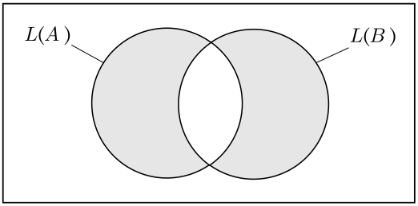

% Decidability
% zdszero
% 2022-04-30

## Concepts

> Def: A language is called Turing Recognizable if some TM recoginzes it.

> Def: A language is called Turing Decidable if some TM decides it. (if a decider can be designed to decide it)

> Def: A language is decidable iff it is Turing-recognizable and co-Turing-recognizable. 

When TM M is given some input w, there might be three results:

* Accept by reaching $q_{accept}$
* Reject by reaching $q_{reject}$
* Keep computing forever, which is $loop$

**A Language of a Turing Machine** is simply the set of all strings that are accepted by the Turing Machine.

Consider a Turing Machine $M$ and a language $L$ that is recognized by $M$. Thus, when we simulate a string $\omega \in L$on $M$, the result is always acception. 

Consider the languages that are not in $L$ (we call it $\bar L$). When we simulate a string $\omega \in \bar L$ on $M$, there are two possibilites:

* Reject
* Loop

If $M$ only reject in this scenario, then $M$ is a **decider** for $L$ 

## Decidability

### DFA

Here are some examples (all of them are decidable):

1. $A_{DFA}$ =  { <B, w> | B is a DFA that accepts input stirng w }

$A_{DFA}$ is **language** which contains the encodings of all DFAs together with strings that DFAs accept. 

Why we introduce languge in this problem? Because we can transform the problem of testing wheather a DFA B accepts w into the problem of testing wheather <B, w> is a member of the language $A_{DFA}$

And we have this theorem

> $A_{NFA}$ is decidable language 

So we can construct a TM $M$ to decide the language. In other words, run w on B, which saves the current state of B and the next input token.

简单来说，就是我们现将问题抽象一下，变成一个语言，也就包含所有这种种类的问题了。然后我们再引入图灵机，尝试decide这个语言，也就是我们应该设计一个algorithm，具有有限的步骤，来决定这门语言（对于这个问题，也就是设计一个方法，来确定DFA可以接受w，或者拒绝w）。

2. $A_{NFA}$ =  { <B, w> | B is a NFA that accepts input stirng w }

use TM to convert NFA to DFA first

3. $A_{REX}$ =  { <B, w> | B is a regular expression that accepts input stirng w }

use TM convert REX to NFA first

4. $E_{DFA}$ = { <A\> | A is a DFA and L(A) = $\emptyset$ }

use bfs to traverse all states

5. $DQ_{DFA}$ = { <A,B> | A and B are DFAs and L(A) = L(B) }

$$
L(C) = (L(A) \cap \overline{L(B)}) \cup (\overline{L(A)} \cap L(B))
$$

如果$L(A) = L(B)$，那么两个子表达式都是$\emptyset$，所以只需用两个TM证明子表达式都是空集即可。 



### CFG

1. $A_{CFG}$ = { <G, w> | G is a CFG that generates string w } 

convert G to an equivalent grammar in Chomsky normal form, and yield all the strings

2. $E_{CFG}$ = { <G> | G is a CFG and L(G) = $\emptyset$ } 

3. $EQ_{CFG}$ = { <G, H> | G and H are CFGs and L(G) = L(H) } 

not decidable!

## Undecidability

### Diagonalization

证明无理数是uncountable的，首先假设无理数是countable的，那么我们选取区间[0, 1]间的无理数，一行行地罗列出所有这些无理数：

```
r1 = 0 . 5 1 0 5 1 1 0
r2 = 0 . 4 1 3 2 0 4 3
r3 = 0 . 8 2 4 5 0 2 6
r4 = 0 . 2 3 3 0 1 2 6
r5 = 0 . 4 1 0 7 2 4 6
r6 = 0 . 9 9 3 7 8 3 8
r7 = 0 . 0 1 0 5 1 3 5...
```

选择对角线的数字`x`，将其变换为`(x+1) % 10`，那么可以得到一个新的无理数，这个无理数不是在已经罗列出的无理数中的，所以无理数是uncountable的。

### samples

$A_{TM}$ = { <M, w> | M is a TM and M accepts w } 

$A_{TM}$ is turing recognizable but not turing decidable.

这也就是停机问题的形式化表述：不存在一个图灵机，能判断另一个图灵机在给定输入的情况下会不会停机。

