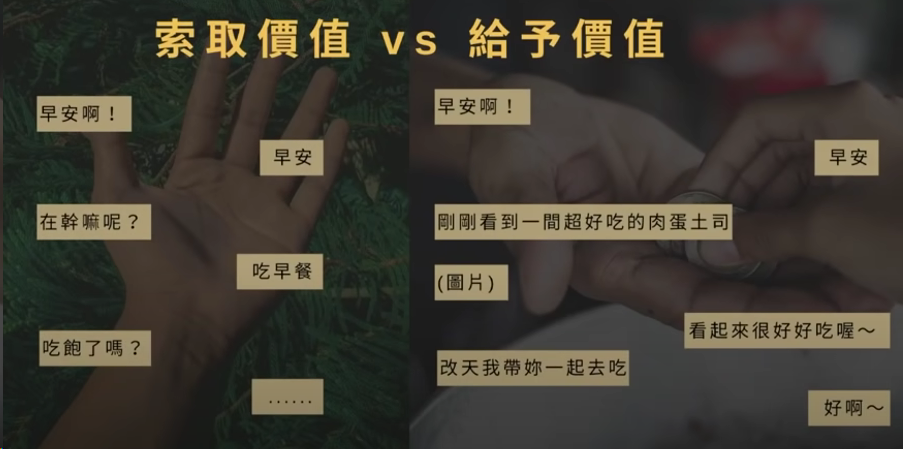

% 直男手册 v0.4
% zdszero
% 2021-10-23

## 一些感想

* 学习这些知识的 **目的** 究竟是什么？

并不是说直男就不好，但是暖男相比直男确实更能体会女性的情绪。两性之间的思维方式还是差异比较大的，所以恋爱双方都应该试着去理解对方，进而可以更好地维护亲密关系。

学习和女孩相关的知识 **绝不是** 为了PUA女孩或帮助你泡女孩子什么的，这些知识是为了帮助你能更好地了解和认识女孩子的心理，也能帮助你更好地明白自己在一段关系的发展中应该发挥着什么样的作用。

* 这些与女孩相关的知识 **有必要这么这样学习** 么？

个人认为 **各类** 知识的学习无非是通过两种途径：方式一是从自己过去的经验中学习，方式二是从别人的经验中学习。

但是现代人都很忙，如果你是一个对其他方面也有要求，需要花费大量时间的人，你用于与女生交往的时间肯定也就没那么多。所以方式一不太行得通，大多数人应该采用方式二。这篇手册就是对别人经验的一些总结，主要参考了一些书籍、文章和视频，并且加入了一些个人诠释，仅供参考。

* **给男人的一些建议**

1. 唯一能让你在一段关系中保持主动权的方式就是 你有勇气能离开这段关系。当她知道你在这一段关系中没有主动权，她就会不断地去踩你的底线。如果你在一段关系中不快乐，你没有得到你应有的对待时，那我是愿意离开这段关系的。
2. work on yourself，不要害怕失去女生，你要让女生害怕失去你。你对女生再好也没有用，你的态度会决定，你到底配不配得上她。
3. 如果你连外表打理都不投资的话，你谁都配不上。
4. 如果你在职场方面没有任何进展，你也谁都配不上。
5. 如果你没有开阔自己的兴趣以及社交圈的话，那没有任何一个高等级的女人会看得上你。
6. 如果你基本的社交能力都不培养的话，同样也没有高价值的女人会看得上你。

* **我身边女生太少**

不要把搭讪当作一个脏的、不好意思的过程。搭讪就是 **认识朋友** 的过程。因为媒体的长期洗脑，所以大多数人对于“搭讪”都是有一个不好的刻板印象。而且女生也享受被搭讪的过程，虽然她可能在表面上可能表现出不喜欢这个过程。

## 女性思维

* **慕强，不喜欢做选择**

能不让女生做选择，就尽量不要让女生做选择，很多女生是有选择困难症的，所以我们要直接帮她做最优选择。如果任何事情你都需要问女生的意见，就会让你在女生心目的形象非常墨迹、窝囊。

女生慕强不仅仅指你有多富有，在某个领域多有造诣，而且是你在一段男女关系中的强势。你应该是一个有主见、有态度，能够带领女生的男人。

如何还是不得不做选择的话，将是非题变成选择题，潜在地提供一个答案。

> ❌要不我送你个小礼物？或者讲个笑话？
>
> ✔️ 我买了两张电影票，你准备一下，我来接你

在实际过程中可以根据情况调节强势的度，见机行事。

* **喜欢皮**

皮就是捉弄、闹腾对方，就跟小时候跟女生交流一样。平淡无奇、木讷死板的聊天无法激发女生的情绪，要学会用轻松幽默的口吻适时地去调侃女生，激发对方的情绪。

> 我刚刚数了下
>
> 你一共打了六次哈欠，看了四次手机。
>
> 怎么？跟我一起看电影很无聊哈
>
> 要是不想影响别人，我差点就大吼一声，把你吓一个机灵。

一般皮一次过后也要在女生面前展现一次关爱、认真，这样女生内心就会对你产生各种情绪。

* **母性**

女生最喜欢刚柔并济的男人，为了维护一段长期关系，不需要长期高高在上的形象，可以在女生面前适当示弱，可以激发女生的母性。

> 昨天天气有点冷，我貌似感冒了
>
> > 哈？严重么
>
> 说严重吧其实也还好
>
> 不吃药的话，一般扛几天就好了
>
> 说不严重吧
>
> 没有你的照顾心里好像不太得劲儿
> 
> > 哈哈哈，你想要怎么照顾
>
> 要是能和美女一起吃一顿清单的晚餐，在让美女给我按摩按摩脑袋，肯定就会好起来了
> 
> > 你不要得寸进尺哈
>
> 开玩笑的，男生的脑袋可不能随便摸，不过吃一顿晚餐总可以把，我已经订好餐厅了

* **喜欢表达感受**

抓 **关键词** 进行 **陈述** 和 **提问** 来引导他说出自己的感受，在一个句子中关键词常常是那些表达情绪的词。

引导女生说出新的感受后，可以继续使用DFS遍历其中的关键词，并且在适当的时候进行回溯。

> 我上星期去泰国旅行了
>
> 关键词：泰国、旅行
>
> > 陈述体验
> >
> > 有时间出去走走真的挺好的，多感受这个世界的惊喜
> >
> > 疑问
> >
> > 旅行是你的爱好嘛？
> >
> > 泰国确实是个很适合的地方呀，你觉得泰国怎么样？

* **注重体验，喜欢想象**

通过语言文字，让人和具体的事物联系起来，描绘成一个画面。

* **矜持内敛，话不直说，需要体会潜台词**

体会深层含义才能更好地进行回复。

> 我晚上不怎么吃东西的 → case1：想吃但不好意思吃，一般出现在初次约会时。  case2：确实在减肥，晚上吃得少
>
> 那个女生好好看呀！→ case1：真得觉得好看。  case2：试探一下你的反应
>
> 你跟你前女友也这样吧？ → 

p.s. 女生是几乎不会与喜欢的人提到前男友的

* **喜欢被偏爱**

在你与她聊天或者日常相处的过程中，是不是透露出偏爱。

## 聊天

### 注意事项

* 给予价值，不要索取价值

学会 *野性* 的说话方式

1. 教导的说法方式（可以在教导之后称赞女生）
2. 指令型说法方式

> 哎，会不会呀，我教你
>
> 天气很冷，外套你穿一下

* 不要总是秒回

秒回一是会暴露你的需求感，让女生觉得你无所事事；而是不假思索的回答可能效果并不好。

* 不要解释

有时候自己做错了某些事，或者某些话女生理解错了，不需要解释。

有些哥们感觉自己做错了事，总是喜欢解释，觉得这是人与人之间最基本的尊重，可以给到女生安全感。但是一定要把握好度，给得安全感太多太满就与舔狗无差别了，解释这件事只会发生在上级和下级的关系之间，要记得你和女生的关系是平等的。

* 敢于说再见

当聊天进入尬聊状态后，要学会适时止损，主动终止聊天。

有时候也要学会留足新奇感，主动终止聊天，勾起女生的情绪和好奇心。

* 不要每天都聊

如果能找到有趣的话题的话，就找女生聊一聊。没有什么有意思的话题的话，就自己忙自己的。要保证每次和女生聊天的时候，都能聊一些有趣的话题，分享一些好玩的事情、丰富的生活。

* 学会制造暧昧氛围

* 把握好主动权

在聊天和与女生相处的过程中，一定要记住你和女生的关系是 **平等** 的，不要随便满足女生的要求，也不要在聊天的过程中亏欠自己。以上提到的几个原则也是基于这点，记得与女生相处的过程就是博弈的过程，一定要让天平保持平衡或者稍微偏向你这一边。

### 参考答案

以下为某些常见问题、话题的参考答案

当女生问你带🌟的问题的时候，她基本就是喜欢你了。

* **安慰女生**

女生向你抱怨的时候，她并不是想让你帮她解决问题，她只是想跟你发泄而已。告诉对方我懂你，并且在适当的情形下提出一些建议，那就会让女生觉得你懂她。

可以采取如下步骤：

1. 倾听：先仔细听听发生了什么。
2. 询问：很多时候女生说的话男生并不能完全理解，因为女生讲话更注重情绪感受，男生更注重表达的逻辑。这个时候我们就需要多以询问为主，让女生把这件事情和她的情绪都表达出来，并且获取事情的全貌。
3. 引导：我们可以进行一些自我暴露，表示你曾经也有过某些相似的经历，你懂她的感受。
4. 转移注意力：在女生情绪低落的时候，可以陪她做一些转移注意力的事情。比如我们有些对于女生不好讲的道理，你可以借用“别人”的方式说出来。

> 怎么了，发生了什么事？跟我说说
>
> 抱抱抱抱，不生气了哈，他脾气不好，我们不跟他一般见识。
>
> 我明白你的感受，这种事情我也经历过，我懂。阐述自己相似的经历...
>
> 哎我有一个朋友之前也遇到过和你一样的情况，讲述朋友的经历，在其中穿插一些道理

* **哄生气**

主动去哄，不要冷暴力。从细节处发生女生生气的苗头，如果有，马上掐灭。

不要盲目地去认错和道歉，沟通才是硬道理。不问因果的道歉只会让事情变得越来越坏。

可以开启 话痨模式 + 转移注意力法则。花式哄，没有女生是不喜欢甜蜜的，如果有，那就是不够甜蜜。可以给她精心地准备一份小礼物，或者带她去吃一顿好吃的大餐。

如果都不管用的话，就把她一把搂进怀里。

* **你在干嘛？**

女生问你这种问题一般都是对你有意思。

刚认识阶段：女生对你不熟，这个时候就是展示自己的好机会，千万让回答显得自己无所事事。

> 我刚忙完一件很重要的事情

对你有好感阶段

> 我在想你，你信么
>
> > 我不信
>
> 不信就对了，我不喜欢来得太快的
>
> > 信啊
>
> 哈哈所以你是不是要给我一些奖励

相互暧昧阶段

> 我在沙发上发呆呢，好无聊，你呢
>
> 进行邀约

另外一个巧妙的回答：

我在想你，你信么 → 我不信 → 其实我在思考一个问题 → 什么问题 → 大聪明和小笨蛋有什么区别 → 某个回答 → 大聪明在想一个人的时候，会说我在想你，而小笨蛋只会说你在干嘛

* **你到底喜欢我什么呀？**

这个时候要观察女生的情绪、语气和神态了，如果女生是略带羞涩、不好意思，那她就是单纯想知道答案，夸夸她就行，把她夸到开心就行。

1. 先说她的优点，注意可以采取一些细节
2. 然后再说自己的感受

我比较肤浅，就喜欢你长得好看又可爱。哈哈哈，开个玩笑，就是觉得你性格特别活泼可爱，然后我和你相处聊天的时候特别开心放松。

* **你是不是想追（喜欢）我？**

在面对这个问题时，一定要记住喜欢一个人和要追求一个人是两个完全不同的概念。然后皮一点的回答可以让你处于更佳的境地。

> 是呀，要收费么
> 
> 是对你有好感呢，但是有好感和想追一个女生是两个概念吧。
> 
> 你是不是经常问男生这个问题？
> 
> 那我猜，你只会问自己喜欢的人这个问题吧

* **恋爱观**

谈恋爱主要是享受双方都相互喜欢的那种感觉，交往的时候轻松愉快，没有包袱，然后真诚平等，我觉得这种是最好的。

我觉得世界上几乎没有那种完全配对的人，好的感情一定是双方相互磨合，一起成长的，在谈恋爱的过程中，有什么不满意的地方一定要说出来了，当然是在冷静下来的时候。

* **怎么维持一段很长的恋情**

从男生的角度来说主要有三点吧：

1. 对待生活、恋情方面做一个好男人，给女朋友充足的关心与爱，与女朋友相处的时候做一个坏男人，学会flirt和逗女生开心
2. 不断提升自己，保持对女朋友的吸引力
3. 循序渐进，不要一开始爱就给得太满

* **你为什么对我这么好？**

哈，我对你很好么？

你可千万别学别人以身相许啊。

那我猜你是想让我对你坏一点？

那翻译过来就是，你想让我对你更好一点，是么？

既然是这样，那礼尚往来，你是不是应该也对我好一点

* **我来大姨妈了，肚子好痛**

你这个亲戚真讨厌，就会趁我不在的时候欺负你。

我在的话，肯定和她一起欺负你呀。

哈哈哈，开玩笑的。如果我在的话，肯定让你这位亲戚舒舒服服地离开。

专业按摩，秘制红糖水再加上我这个恒温人肉暖宝宝，让姨妈舒舒服服来，开开心心走

* **🌟 你觉得我怎么样？**

当一个女生问你对她的看法时，说明她是非常在意你的，对你不感兴趣的女生才不会问你这些。

其实在这里把女生夸开心了就可以了，但是注意不要只关注外在，更要专注内在，如果能在这个过程中包含一些生活上的细节与一些小事，那么就完美了。

我觉得你是个活泼可爱的女生，性格听开朗的，内心也很善良，尤其是那天，看你在路边喂流浪猫的时候，感觉你和其他女生是不一样的。

* **🌟你喜欢什么的女生？**

✖ 我就喜欢你这样的。这种回答非常油腻，不真诚，瞬间让女生对你的好感清零。

✔️ 正确回复思路：你要表达出自己的标准，以及与那些只会看外表的人不同的，对于内在和三官的关注。

我比较喜欢活泼可爱、性格大方、内心善良，长头发的女生，不过最重要的是两个人在一起能聊得来，毕竟人总会老的嘛，但内在不会，那种活泼轻松的相处氛围也不会。

* **🌟 你现在有喜欢的人么？**

我觉得这个需要用实际行动来证明，下次你摸摸我的心跳，看看会不会扑通扑通的。

* **🌟 你现在有谈恋爱的打算么？**

感情这种事情，我觉得不能强求吧，遇到互相喜欢相爱的人，才会有谈恋爱的想法。

## 误区

* **害怕追求失败尴尬**： 女生是喜欢被追求的，你追求一个女生，只要方式得体，不让女生难堪，女生内心都是会有一些感动和感激的。而且对你也没有任何的损失，如果女生觉得你人不错，但不适合她自己的话，甚至可能把你介绍给她的朋友。
* **对女生太好**：容易增加女生的厌恶感、促进女生的高冷。
* **爱讲道理**：谈感受，不要总是理性思维地讲道理。
* **暖男不是爸爸**： 有时候女生对你诉苦，你只需要做她的肩膀就可以了，好好安慰安慰她，毕竟不是自己领域内的东西。不需要神神叨叨的，会让女生觉得烦。
* **过早暴露自己的需求感**：从而做出一些奇怪的行为。正确的方式是把你有好感的女生也尽量当作普通朋友对待，可以增加别人对你的需求感。当你为女生产生不良情绪的那一刻起，你就已经输了，因为人家已经完全能够影响到你了。
* **刻意迎合**：讲话总是精心编造，生怕得罪对方。正确的方式应该是不卑不亢，轻松自然。让女生觉得你有点琢磨不透，不在她的掌控范围内。
* **等我变优秀了，再去追求她**：女生也同样会有这种情绪，女生相比男生是比较缺乏安全感的动物，她们更容易多想。
* **我不够帅**：虽然女生喜欢帅哥是亘古不变的真理，但不代表女生就会找帅哥做男朋友，现实不是偶像剧和爽文。
* **我不够会**：真诚是最重要的，套路太多往往显得画蛇添足。
* **没有积极去了解对方**：对方总是了解你，但是你没有去了解对方，没有达到对方的期待值。这让女生感觉你对于她的很多事情为什么总是无动于衷。
* **没有原则**：为了女生的喜好去改变自己的原则
* **喜欢主动臆想，内心戏太多**

## 吸引力

* **新奇感，神秘感**：让女生想了解你。
* **专注，自律**：不光要投资关系，更要投资自己。女生不是靠追来的，是靠吸引来的，追来的女孩你很可能只是暂时感动到了她，最后不属于你的还是不属于你的。
* **懂她，共情能力**：
    * 会安慰女生，会引导女生的情绪
    * 体贴
* **坏坏的**：假不正经，可以给女生带来情绪波动和恋爱体验感
* **领导力，有自信**：这就是为什么女生都喜欢那种霸道总裁，该主动的时候就要主动，适当的时候主导一些事情。
* **反差萌**：做出一些和你给别人留下的印象不同的行为。
* **有礼貌，绅士**：待人接物应该谦逊有修养，从小事入手。
* **高逆商**

## 恋爱心理学

* **73855定律**

我们对别人的第一印象，有7%是来自别人说的话，38%来自别人说话的语调，55%来自别人的外形和肢体语言。

* **边际效应**

当人无条件地得到越来越多的好处时，就会感到厌烦。

在追求一段关系时不要一味的讨好，自己的喜恶都要明确地表达出来。相比那些无底线对自己好的男生，女生更青睐那种能让自己喜忧参半的男生。后者通过自身的展示，可以让女生明白，我是一个挑战性十足的男生，我懂得表达自己的感受，拥有自己的择偶框架。

* **超限效应**

刺激过多、过强或作用时间过久，从而引起心理极不耐烦或逆反的心理现象。

追女孩时不要天天找，注意频率和强度。

* **损失厌恶**

人们面对同样数量的收益和损失时，认为损失更加令他们难以忍受。

当你在一段关系中不平等时，要有退出这段关系的关系，这样才会让女生更加关注你这个人。

* **富兰克林效应**

相比那些被你帮助过的人，那些曾经帮助过你的人会更愿意再帮你一次。换句话说，让别人喜欢你的最好方法不是去帮助他们，而是让他们来帮助你。如果想得到别人的好感，主动开口是没坏处的。

当一个人寻求你的的帮助，并且你帮了他，哪怕你对这个人之前没有太多的好感。但是你的大脑和潜意识会给自己暗示，他是一个不错的人，我对他是有好感的哦。

别人帮助了你，你将来再借机回报别人一下，一来二去就建立联系了。

* **黑暗效应**

在光线比较暗淡的场所，约会双方都看不见彼此的表情，就容易减少戒备感而产生安全感。

约会可以选在光线较为暗淡的场所，女生会更放松一些。

* **吊桥效应**

当个人提心吊胆地过吊桥的时候，会不由自主地心跳加快，如果这个时候，碰巧遇见另一个人，那么他会错把由这种情境引起的心跳加快理解为对方使自己心动，才产生的生理反应，从而觉得，自己是爱上了对方，这是爱的感觉。

可以通过刺激活动让对方心痛和爱上我们。

* **首因效应**

交往双方形成的第一次印象对今后交往关系的影响，也即是“先入为主”带来的效果。虽然这些第一印象并非总是正确的，但却是最鲜明、最牢固的，并且决定着以后双方交往的进程。

第一印象很重要

* **近因效应**

指在多种刺激出现的时候，我们印象的形成主要取决于后来出现的刺激。即交往过程中，我们对他人最新的认识会占据主体地位，掩盖了以往形成的对他人的评价。

一个人对另外一个人的印象受到最近一次接触的影响很大

* **霍桑效应**

当我们被我们喜欢的异性关注时，我们会格外注重自己的言行举止，以便给对方留下一个好印象。

放在两性相处中，如果运用的恰当，能够改善情侣之间的关系，让对方成为你理想中的爱人。你经常夸奖伴侣，关注他的需求，给他鼓励和信心，他就会希望努力表现好自己，得到你更多认可，对你更好，让你越来越满意。

也可以抓住另一半日常生活中的一些细节的点进行称赞。

* **阿伦森效应**

指随着奖励减少而导致态度逐渐消极，随着奖励增加而导致态度逐渐积极的心理现象。

一个人如果做了100件好事，然后做了1件坏事，别人就会觉得他变坏了。相反，如果一个人做了100件好事，然后做了1件好事，别人就会觉得他变好了。

追求女生时要循序渐进，不要一上来就设定过高的期望阈值，不要做太多超出自己负荷的事情。

* **投射效应**

人在认知和对他人形成印象时，以为他人也具备与自己相似的特性的现象，把自己的感情、意志、特性投射到他人身上并强加于人，即推己及人的认知障碍。

* **菲斯汀格法则**

生活中发生的事情只能从%10的程度上影响你，另外90%是你如何对待发生的事情。

* **蔡格尼克记忆效应**

人对未完成的事情比已完成的事情印象更加深刻。

* **社交认证**

别人会通过你身边的人或事，来判断你这个人的价值和层次。

* **反向形成**

人有时心中讨厌或憎恨一个人，但在表面上却又对此人十分热情和关心；有时心里喜欢一个人，表面上却异常冷淡。无意识的冲动在意识层面上向相反方向发展，人的外表行为或情感表现与其内心的动机欲望完全相反，在心理学上称为反向形成或反向作用、反向行为、矫枉过正，是心理防御机制之一。

> 我觉得我挺懒的。我觉得我不太有主见。我不太爱化妆。

* **光环效应**

某人的某个显著的局部特征的看法被盲目扩大化，变成对此人整体的看法。当一个人喜欢一个人或者一个事物时，会合理化它身上的其他不合理行为。

当女生喜欢一个男生时，也会出现光环效应。对他可能的缺点不会讨厌，反而觉得很特别。

同时如果一个女孩给我们的印象不错，我们一不应该在脑海中把她脑补成一个白月光的形象，这样可能会让我们合理化她们不合理的行为。应该每个女人都有自己的阴暗面，不要持有太多的期待。

* **自证预言**

意指人会不自觉的按已知的预言来行事，最终令预言发生；也指对他人的期望会影响对方的行为，使得对方按照期望行事。

在一段关系中不要疑神疑鬼，患得患失，你的担忧会更可能成为事实。

* **留白效应**

在约会和约会之间，沟通和沟通之间，留下一段空白，给对方思考和回味。

* **拆屋效应**

华人的性格喜欢调和，为了达成某个目标，可以先提出一个不合理的要求（你大致也知道不会被满足的），然后再提出你真正的目标，此时目标被满足的概率更大。

* **鲶鱼效应**

在一段亲密关系中尽量多创造“第一次”，也就是向关系中引入鲶鱼的过程。无论是什么样的新东西，想尽办法把它加到两人的关系之间就对了。

两个人一起去找两个人都没有尝试过的东西，然后一起去尝试。

## 暗示信号

**线上**

* 经常和你聊自己的喜好、想法，分享自己的生活
* 展现她的脆弱面
* 梦到你了
* 愿意去了解你，问你许多问题
* 不拒绝的你的好意、示好行为
* 撒娇，想要依靠你，时而变得傻白甜，时而显得柔弱
* 不吝啬夸你
* 不由自主地为对方付出
* 爱屋及乌，开始学习你感兴趣的东西
* 和你在一起的时候不自觉地变得温柔、乖巧
* 不喜欢你和异性产生的一切关系
* 说如下话
    * 你吃醋了
    * 你在干嘛
    * 你是不是喜欢我
    * 有意无意地夸你

**线下**

* 和很多人一起活动时时不时看向你
* 和你约会时精心化妆
* 冷场时主动寻找话题，话题无聊她会做延伸

## 其他的一些问题

* **值得追的女孩特点**

1. 感情世界井井有条，不会吊着别人
2. 尊重别人，知冷知热
3. 有独立的精神物质世界
4. 爱情观、金钱观、价值观和你一致
5. 对事物保持积极乐观
6. 有独立思考的能力，自立

* **如何面对聊天时产生的焦虑感？**

焦虑感往往来源于如下几个方面：你的需求感过强，你对这段关系缺乏掌控感，害怕竞争对手过多。当你越是焦虑的时候，你就越应该保持一颗平常心，你得牢记，爱情固然重要，但只是生活中的一部分，在爱情中你要坚持做自己，也要释放自己的本性，焦虑主要来源于你自己不舒服，所以你首先要让自己舒服。你自己舒服了呢，对方才能舒服，才能让你们这段关系更加轻松。只有你成为你自己，爱你自己，你爱的人才会爱你。

* **约会注意事项**

1. 提前做好规划，不要到时候问女生
2. 准备好话题，尽量让女生多说，搜索聊天内容，输入如下关键词进行查找：喜欢、不喜欢、讨厌、好吃、难吃、好看、难看
3. 收拾好自己

* **追求成功率最高的时期**

女生的瓶颈期或低谷期，这个时期的女生，情绪低落、脆弱敏感，就想身边有个人依靠，有人听她倾诉。

女生频频透露自己寂寞的信号。

身边的朋友都有男朋友，疯狂给她撒狗粮的时候。

* **表白有必要么**

> 表白不应该是吹响进攻的号角，而应该是宣布胜利的凯歌。

第一种方式： **确定女生对你有好感后再表白** 

如何确定？信号如下：

* 经常主动找你聊天，并且情绪比较高，很有耐心，对于你稍显冷漠的回复也能积极回应，并且记得你聊天过程中提到的各种细节
* 愿意制造和你见面的机会，可能不会那么主动，但是会给你暗示
* 会和你进行肢体上的互动，并且不排斥你。或有意无意间的肢体接触，不介意突破20cm的安全距离
* 愿意单独陪你约会，并且每次都呆比较长的时间，或去比较私密的场所
* 肯为你改变自己的穿搭风格
* 为你改备注，取一个特殊的外号

如果把结果当成薛定谔的猫的话，那么在表白之前，你永远不知道结果。而以上条件满足得越多，盒子就越透明。

第二种方式： **不表白，直接以行为确定关系**

**能不表白就尽量不要表白。** 当你对女生表白时，常常是这种方式：你愿意让我做你的男朋友么？这时候时候就给女生提出了一个问答题，yes or no，这时候即使是对你有好感的女生也可能因为矜持拒绝你，所以有机会的话是逐步通过肢体接触不断升华关系，从而达到不表白让双方都内心清楚的效果。

* **如何与对你有好感的女生进行关系升温**

不要直接表白，在暧昧的阶段，通过正确的方式慢慢升温，就会自然而然地在一起。

多使用肢体接触，肢体接触多了，你在女生心里就会变得很特别，情不自禁就会喜欢上你

1. 过马路牵住女生的手，过完马路观察女生的反应
2. 你可以做我女朋友么？ → 我可以抱你么？
3. 我喜欢你？→ 我想和你一起做某一件事
4. 问女生你介意我做某件事情么

* **接吻信号**

不排除和你有近距离身体接触，甚至对你动手动脚

四目相对超过5秒

不介意和你用同一根吸管，同一杯饮料，在吃饭的时候让你喂她

为了听悄悄话，主动把耳朵凑近你

拥抱后抬头

* **如何为爱情保鲜**

1. 适当的与她分享你的秘密
2. 不时的制造一些惊喜
3. 记录感情 —— 那些美好的时刻和记忆
