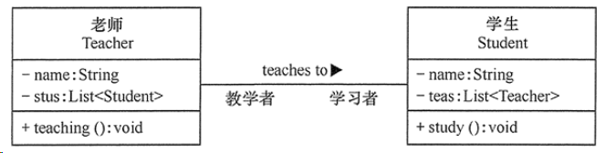
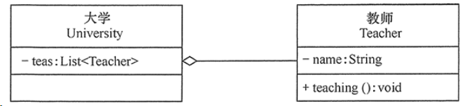

% UML
% zdszero
% 2022-06-08

## relationships

### dependency

耦合度最弱的一种关联方式，是临时性的关联。

某个类的方法通过局部变量、方法的参数或者类的静态方法来访问另一个类的某些方法来完成一些职责。

用 虚线箭头 表示

### association

将一个类的对象作为另一个类的成员变量。关联可以是双向的，也可以是单向的。

用 实线箭头 表示

### aggregation

聚合（Aggregation）关系是关联关系的一种，是强关联关系，是整体和部分之间的关系，是 has-a 的关系。

聚合关系也是通过成员对象来实现的，其中成员对象是整体对象的一部分，但是成员对象可以脱离整体对象而独立存在。

### composition

组合（Composition）关系也是关联关系的一种，也表示类之间的整体与部分的关系，但它是一种更强烈的聚合关系，是 contains-a关系。

在组合关系中，整体对象可以控制部分对象的生命周期，一旦整体对象不存在，部分对象也将不存在，部分对象不能脱离整体对象而存在。

### generalization

泛化（Generalization）关系是对象之间耦合度最大的一种关系，表示一般与特殊的关系，是父类与子类之间的关系，是一种继承关系，是 is-a 的关系。

### realization

实现（Realization）关系是接口与实现类之间的关系。在这种关系中，类实现了接口，类中的操作实现了接口中所声明的所有的抽象操作。

