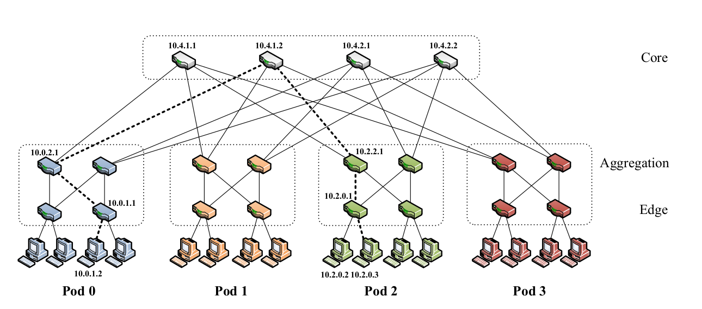

% Advanced Network Review
% zdszero
% 2022-06-04

## FatTree

### Addressing

* network address range: `10.0.0.0/8`
* core switch address: `10.k.j.i`
    * j, i: coordicates in the $(k/2)^2$ core switch grid 
* pod switch address: `10.pod.switch.1`
    * pod: `[0, k-1]`
    * switch: `[0, k-1]`, starting from bottom to top, left to right
* adddress of a host: `10.pod.switch.ID`



### routing algorithm

* generating aggregation routing table for upper pod switches

```
foreach pod x in [0, k-1] do
    foreach switch z in [(k/2), k-1] do
        foreach subnet i in [0, (k/2)-1] do
            addPrefix(10.x.z.1, 10.x.i.0/24, i);
        end
        addPrefix(10.x.z.1, 0.0.0.0/0, 0);
        foreach host ID i in [2, (k/2)+1] do
            addSuffix(10.x.z.1, 0.0.0.i/8,
            (i-2+z)mod(k/2)+(k/2));
        end
    end
end
```

* generating aggregation routing table for lower pod switches

```
foreach pod x in [0, k-1] do
    foreach switch z in [0, (k/2)-1] do
        addPrefix(10.x.z.1, 0.0.0.0/0, 0);
        foreach host ID i in [2, (k/2)+1] do
            addSuffix(10.x.z.1, 0.0.0.i/8,
            (i-2+z)mod(k/2)+(k/2));
        end
    end
end
```

* generating core switch routing table

```
foreach j in [1, (k/2)] do
    foreach i in [1, (k/2)] do
        foreach destination pod x in [0, (k/2) - 1] do
            addPrefix(10.k.j.i, 10.x.0.0/16)
        end
    end
end
```

## BBR

## MPTCP

### congestion control


## SDN

### Why SDN ?

数据平面和控制平面分离。通过控制平面来控制网络中的每个路由器在接受到网络包时的行为：拒绝或者转发，转发的话选择怎样的路径。

可以节省人工配置网络成本、具有更高的扩展性。

SDN在数据中心应用较多，但是大规模部署以及替代传统网络仍困难重重，与它天生的中央控制机制的特性是密不可分的，网络网络总体还是分布式架构。

### Controller

1. Contains the global network policy and topology.
2. Performs **route computation** for permitted flows.

### Switches

1. Simple and dumb.
2. Consisting of **a simple flow table** and **a secure channel** to the controller.
3. Forward packets under instruction of the controller.

**flow table**

Each flow-entry has a simple action associated with it according to MAC, IP or port

* Forward: send this flow’s packets out to a given port (or ports).
* Packet-In: Report this flow’s packets to a controller.
* Drop: drop this flow’s packets.
* Modify: modify certain fields.

| MAC src | MAC dst | IP src  | IP dst | Port | ... | Action     |
| :-:     | :-:     | :-:     | :-:    | :-:  | :-: | :-:        |
| *       | *       | 5.6.7.8 | *      | *    | *   | port1      |
| *       | *       | *       | *      | 25   | *   | drop       |
| *       | *       | *       | *      | *    | *   | controller |

**secure channel**: connect the switch to a remote controller
