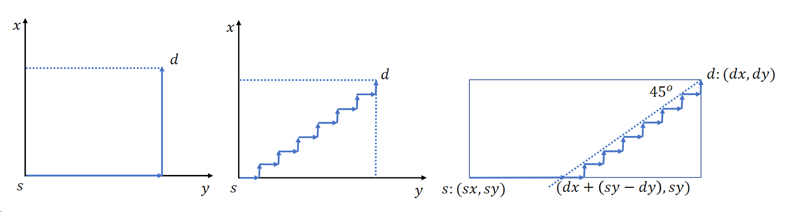

% advanced_os
% zdszero
% 2022-06-09

## 序章

* 什么是分布式系统？

一个分布式系统是多个独立计算机的集合，该系统在用户看来就象一台单个计算机一样。

* 分布式系统的三个特性

模块性、并行性、自治性

* 分布式系统与计算机网络的区别

都提供了一个面向报文的异构性通信环境。

在全局管理、并行操作、自治控制等方面分布式系统有着更高的要求，其主要区别在于系统的高层软件（操作系统、语言、数据库、应用软件）上。

* 分布式系统硬件分类

弗林分类法，采用基于 **指令流数目** 和 **数据流数目** 作为分类依据

1. SISD(single instruction single   data)
2. SIMD(single instruction multiple data)
3. MISD(multiple instruction single data)
4. MIMD(multiple instruction multiple data)


我们把所有MIMD分为两类：具有共享存储器的多处理器系统；没有共享存储器的多计算机系统。

根据互连网络结构的不同，以上两个分类还可进一步细分：总线型、开关型。

另一种分类：紧耦合、松散耦合

## 同步

### 时钟同步

**逻辑时钟同步算法**

我们不关系绝对时间是否准备，只要所有的机器都认同一个逻辑时间就可以，这样就可以保持相对时间前后的关系。

* **Lamport算法**

1. 在同一进程中，如果事件a在事件b之前发生，则$C(a) < C(b)$
2. 如果a和b分别是一个消息的发送和接收事件，则$C(a) < C(b)$
3. 对所有事件a和b，$C(a) \ne C(b)$

每一个消息都含有一个发送者时钟的发送时间,当消息到达时,接收者将自己时钟的接收时间与发送时间相比较。如果接收时间小于等于发送时间,则接收者的时钟被修改成发送时间加1。如果接收时间大于发送时间,则不改变接收者的时钟。

**物理时钟同步算法**

* **Cristian算法**

使用集中的时间服务器对所有的机器进行同步。

设$\rho$为最大漂移率，则若要保证两个时钟相差不超过$\delta$，则时钟必须每$\delta / 2\rho$秒就同步一次，每台机器周期性地向时间服务器请求当前的时间。

* **Berkeley算法**

时间服务器周期地轮询每一个机器当前的时间。收到所有机器当前时间后,计算其平均值。然后,将该平均值发送给每一个机器。每一个机器都将自己的时钟调到这个平均值。

* **非集中时钟同步**

每隔一段时间每个机器广播自己的当前时间，然后每个机器受到其他所有机器的当前时间后，计算平均值。

### 分布式互斥

* **集中式互斥算法**
* **分布式互斥算法**
* **令牌环算法**

### 分布式选举

* **欺负（bully）算法**

某一个发现leader无相应的向其他所有序号比它大的机器发送ELECTION请求，返回OK说明有比它大的机器，当前机器放弃成为leader，然后这样迭代进行，直到选出一个leader，然后leader向其他所有机器发送COORDINATOR消息。

* **环算法**

### 原子事务

* **事务的特性**

1. A: 全做或全部做
2. C: 系统的不变量在事务执行过程保持不变
3. I: 并发执行的事务与某个串行调度相同
4. D: 事务提交后不会丢失

* **并发控制**

加锁，2PL locking

乐观并发控制

### 分布式系统死锁

* **分类**

通信死锁、资源死锁

* **死锁处理方案**

鸵鸟算法、检测、预防、避免

* **分布式死锁检测**

协调者：通过一个协调者保存系统中的所有资源信息，以及资源的持有情况。

假死锁：

Chandy-Misra-Haas算法：message = `<blocking pid, sender pid, receiver pid>`，通过DFS不断修改`sender pid`和`receiver pid`并且发送，若消息转了一圈又到发送者，则说明系统存在死锁。

* **分布式死锁预防**

基于timestamp的 *wait die* 和 *wound wait*

Similarity: The older transaction will "win" over the newer transaction

Difference: 

```
Wait-die:
    The newer transactions are killed when:
        It (= the newer transaction) makes a reqeust for a lock being held by an older transactions
Wound-wait:
    The newer transactions are killed when:
        An older transaction makes a request for a lock being held by the newer transactions
```

对于 *wait die*，在老事务释放资源之前，新事务可能会多次abort自己，*wound wait* 没有这么差的特性。

## 路由算法

### 一般类型网络的最短路径路由算法

* **djkstra**

* **ford**

```
init: d = destination, set D(d) = 0, mark all other nodes as (., ∞)

foreach v != d
    foreach adjacent node w of v
        D(v) := min{D(v), D(w) + l(w, v)}
    endfor
endfor
repeat the above operations util no change is made
```

* **ARPAnet**

与Ford算法比较相似，不同点如下：

* 算法中的节点都维护一个一般化的路由表
    * 这个路由表包含从这个节点到所有其它节点的最优路径的延迟
* 每隔固定的时间间隔，路由表就被传送到它的所有邻接节点，直到最小延迟表在某一点达到稳定为止。

### 特殊类型网络的单播路由算法

* **双向环**

* **2维网格**




(1) XY路由
(2) 最短且完全适应路由
(3) 折线路由
(4) 最大最短路径路由

方案(1)(2)(3)适用于网格，方案(4)适用于圆环

* **超立方**

$Q_{0}$，是只有一个节点的退化图

$Q_{n} = K_{2} \times Q_{n-1}$，具有$2^n$个节点，其中每一个节点的地址可以表示为$u = u_{n}u_{n-1} \cdots u_{1}$

两个节点$\mu, \omega$的最短路径长度（海明距离）为$H(\mu, \omega) = \sum_{i=1}^{n} h(\mu_{i}, \omega_{i})$，其中$h(\mu_{i}, \omega_{i}) =
\begin{cases}
    1 \text{, if $u_{i} \ne \omega_{i}$}\\
    0 \text{, if $\mu_{i} = \omega_{i}$}
\end{cases}$


### 特殊类型网络的多播路由算法

* **基于路径的方法**

* **基于树的方法**

Lan贪婪组播算法

U-网格算法
