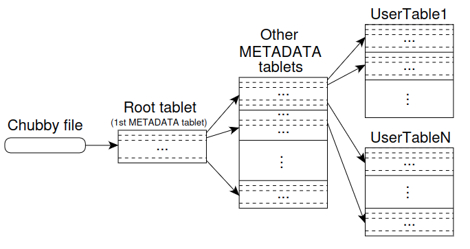

% bigtable
% zdszero
% 2022-07-05

distributed storage system

## data model

a table can contain many tablets, each tablet is located using the three following indexes:

* rows
* columns
* timestamps

## implementation

### three components

* a library that is linked into every client

* one master server

assigning tablets to tablet servers, detecting the addition and expiration of tablet servers, balancing tablet-server load, and garbage collection of files in GFS. In addition, it handles schema changes such as table and column family creations.

* many tablet servers

manage a set of tablets, and handles read and write requests.

### tablet location

root tablet --> metadata tablet --> user table

### tablet assignment

When a tablet server starts, it creates, and acquires an exclusive lock on, a uniquely-named file in a specific Chubby directory.

To detect when a tablet server is no longer serving its tablets, the master periodically asks each tablet server for the status of its lock.

## refinement
