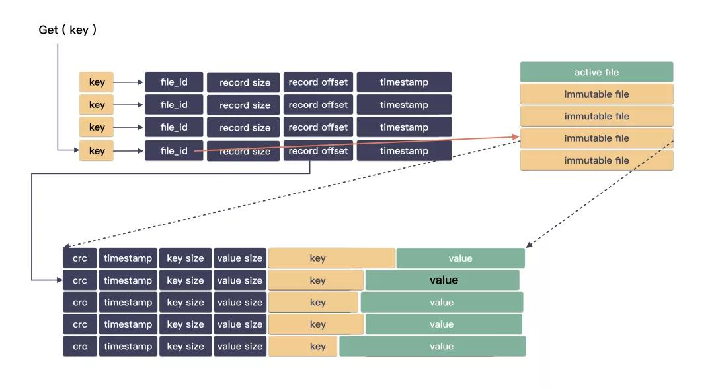

% bitcask
% zdszero
% 2022-07-12

## 设计

1. 基于文件系统，不基于裸盘，依靠kernel buffer cache来提升读取效率
2. 一个磁盘只有一个写入点，叫做active data file
3. 只通过append的方式写入
4. 删除也是写入
5. 日志文件是无序的，通过内存进行索引
6. 通过merge回收磁盘空间，其实就是compact
7. 通过hint file加速初始化过程

## 存储

```
record:
| CRC | timestamps | key size | value size | key | value |

memory index
key →  | file id | value size | value pos | tstamp |
```

## 写

更新内存哈希表，并且写入文件

__思考两点：__

* 从 IO 次数来看，磁盘 IO 只需要整体落一次就够了，不需要单独写索引;
* 从 IO 模型来看，写永远都是顺序 IO，对机械盘来讲，性能最优;

## 读



__思考两点：__

* 从 IO 次数来看，这里性能应该还是不错的，因为只有读数据的时候才需要磁盘 IO ;
* 从 IO 模型来考虑，读是非常大概率导致随机 IO 的，但这个可以依赖于文件系统的缓存，读过的数据将可以加速访问;

## 回收

```
write     read----
  ↓              |
active file      |
immutable file ←-|
immutable file ←-|
immutable file ←-|
immutable file ←-|
```

将所有的immtable file merge成新的文件

方式1：进行一次全体扫描

在已经建立内存哈希表的情况下再次读取文件，扫描文件中所有的entry，如果entry在哈希表中存在并且对应，则将其写入新的merge文件。

方式2：根据哈希表中的内容读

merge 这个是后端程序有时候会和前段的写入并发执行的，但底下磁盘只有一块，两个都是顺序 IO ，但并发起来就成随机 IO 了。所以它的精细之处就在于 merge 的时机选择和速率，这个也是它的含金量之一。

__hint file__

初始化需要读取所有文件，十分耗费时间。在创建merge文件的过程中就生成索引关系并且存储（hint file），可以加速下次初始化的过程。

## 适用场景

这个其实还是比较明显的，Bitcask 无疑是适合小对象的。理由很简单，它从设计上就规定了只有一个写入点( active file )，也就是说用户的写入是串行的，那么如果说用户的 value 特别大，比如 100 M，那么系统吞吐会非常差(比如说，这个时候来了个 1K 的对象，却只能排队)。而如果都是些小对象，那么完全可以聚合很多 key/value ，一次性落盘。这样既满足了顺序 IO ，又提供了很好的系统的吞吐能力。

缺点：

1. 只有一个写入点
2. 建立索引时间花费

优点：

1. 架构简单，充分利用操作系统的功能
