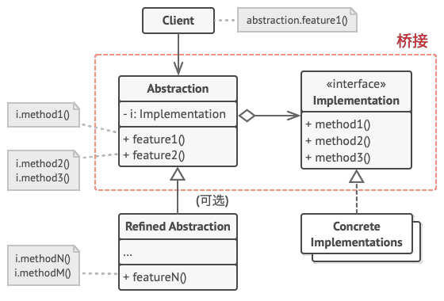
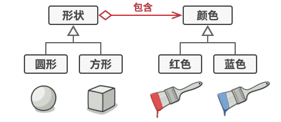
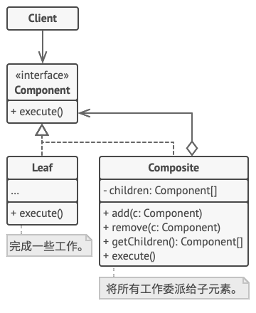
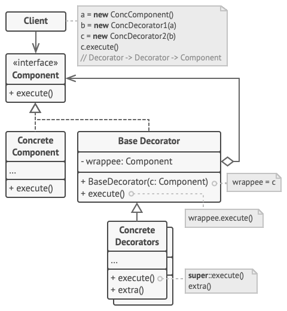
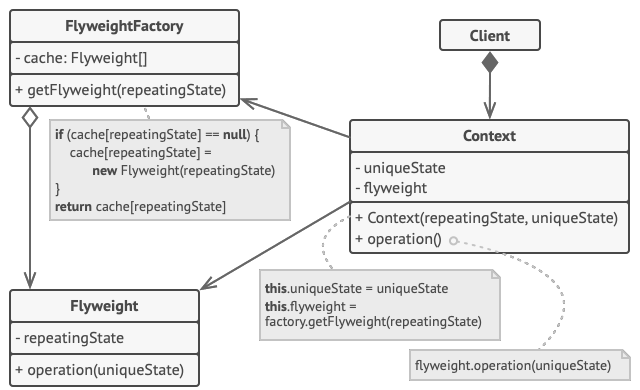
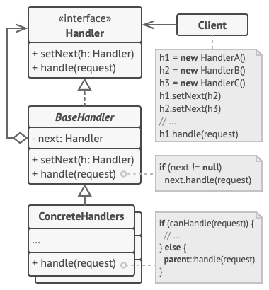
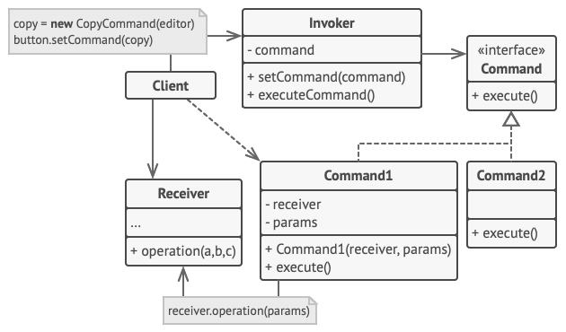
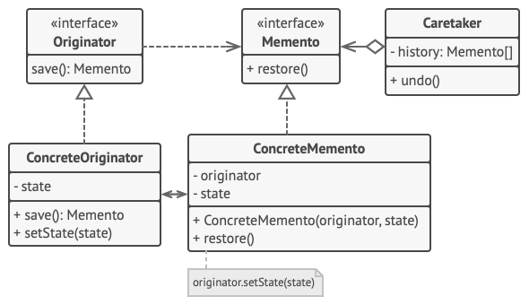
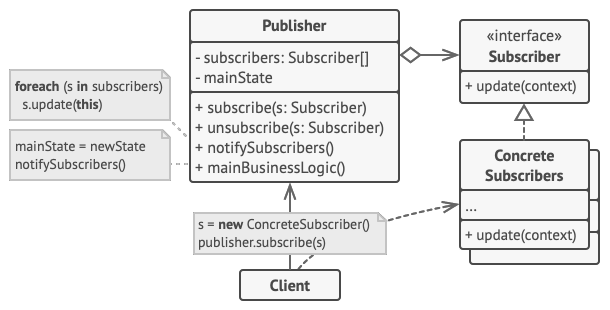

% Design Pattern
% zdszero
% 2022-06-08

% Design Pattern
% zdszero
% 2022-06-06

## 体系结构

分层、管道过滤器、Broker、MVC、映像

## SOLID原则

* S: Single Responsibility Principle（单一职责原则）

> 修改一个类的原因只能有一个

尽量让每个类只负责软件中的一个功能，并将该功能完全封装（你也可称之为隐藏）在该类中。

* O: Open/Closed Principle（开闭原则）

> 对比扩展，类应该是“开放”的；对于修改，类则应该是“封闭”的

如果你可以对一个类进行扩展，可以创建它的子类并对其做任何事情（如新增方法或成员变量、 重写基类行为等）， 那么它就是开放的。有些编程语言允许你通过特殊关键字（例如 final ） 来限制对于类的进一步扩展， 这样类就不再是“开放”的了。 如果某个类已做好了充分的准备并可供其他类使用的话（即其接口已明确定义且以后不会修改）， 那么该类就是封闭（你可以称之为完整）的。

这条原则的意思就是对于一个开发完整的类，你应该通过继承拓展它的行为，而不是直接修改这个类的代码。这指导着我们应该面向接口编程，将抽象的部分提取出来变成接口。

* L: Liskov Substitution Principle（里氏替换原则）

> 当你扩展一个类时， 记住你应该要能在不修改客户端代码的情况下将子类的对象作为父类对象进行传递。

某一个类可能被客户端代码的不同地方使用，当我们希望使用多态的方式来拓展这些类的行为时，不应该修改客户端的代码。一般需要满足如下几点：

1. 子类的 参数类型 和 返回值类型 必须与器超类的参数类型想匹配或更加抽象。
2. 子类不应该抛出基础方法预期之外的异常类型。
3. 父类的不变量必须保留。
4. 子类不应该修改父类中私有成员变量的值。

* I: Interface Segregation Principle（接口隔离原则）

> 客户端不应该强迫依赖于其不使用的方法。

尽量缩小接口的范围，使得客户端的类不必实现其不需要的行为。将“臃肿”的方法拆分为多个颗粒度更小的具体方法。客户端必须仅实现其实际需要的方法。否则，对于“臃肿”接口的修改可能会导致程序出错，即使客户端根本没有使用修改后的方法。

* D: Dependency Inversion Principle（依赖倒置原则）

> 高层次的类不应该依赖于低层次的类。 两者都应该依赖于抽象接口。
> 
> 抽象接口不应依赖于具体实现。具体实现应该依赖于抽象接口。

由于在软件设计中，细节具有多变性，而抽象层则相对稳定，因此以抽象为基础搭建起来的架构要比以细节为基础搭建起来的架构要稳定得多。这里的抽象指的是接口或者抽象类，而细节是指具体的实现类。

依赖倒置原则的目的是通过要面向接口的编程来降低类间的耦合性。

## 设计模式分类

* 创建型模式
    * 工厂方法，抽象工厂
    * 生成器
    * 原型
    * 单例
* 结构型模式
    * 适配器
    * 桥接
    * 组合
    * 装饰
    * 享元
* 行为模式
    * 责任链
    * 命令
    * 迭代器
    * 备忘录
    * 观察者
    * 状态
    * 策略
    * 访问者

## 工厂模式

1. 有时候对象的创建可能需要多个步骤，可以将创建过程进行封装。

```java
Pizza createPizza(String type) {
    if (type.equals(“cheese”)) {
        pizza = new CheesePizza();
    } else if (type.equals(“greek”) {
        pizza = new GreekPizza();
    } else if (type.equals(“pepperoni”) {
        pizza = new PepperoniPizza();
    } else if (type.equals(“clam”) {
        pizza = new ClamPizza();
    } else if (type.equals(“veggie”) {
        pizza = new VeggiePizza();
    }
}
```

2. 将相似对象中的通用的方法作为父类中的方法实现，同时将不同的行为作为抽象方法实现。

```java
public abstract class PizzaStore {
    public Pizza orderPizza(String type) {
        Pizza pizza;
        pizza = createPizza(type);
        pizza.prepare();
        pizza.bake();
        pizza.cut();
        pizza.box();
        return pizza;
    }
    protected abstract Pizza createPizza(String type);
    // other methods here
}
```

**优点**

1. 你可以确保同一工厂生成的产品相互匹配。
2. 你可以避免客户端和具体产品代码的耦合。
3. 单一职责原则。 你可以将产品生成代码抽取到同一位置， 使得代码易于维护。
4. 开闭原则。 向应用程序中引入新产品变体时， 你无需修改客户端代码。

## 单例模式

1. 保证一个类只有一个实例。
2. 为该实例提供一个全局访问点。

```cpp
class Singleton {
public:
    Singleton(const Singleton &) = delete;
    Singleton& operator=(const Singleton &) = delete;
    static Singleton *get() {
        if (!instance) {
            instance = new Singleton();
        }
        return instance;
    }
private:
    Singleton() {}
    static Singleton *instance{nullptr};
};
```

## 原型模式

原型模式将克隆过程委派给被克隆的实际对象。 模式为所有支持克隆的对象声明了一个通用接口， 该接口让你能够克隆对象， 同时又无需将代码和对象所属类耦合。

```cpp
class Prototype {
public:
    virtual ~Prototype() {}

    virtual Prototype *clone() = 0;
    virtual std::string type() = 0;
};

class ConcretePrototypeA: public Prototype {
public:
    ~ConcretePrototypeA() {}
    Prototype *clone() {
        return new ConcretePrototypeA();
    }
    std::string type() {
        return "type A";
    }
};

// ConcretePrototypeB is the same
```

## 生成器模式

分步创建复杂对象，生成器模式允许你使用相同的创建代码生成不同类型和形式的对象。

```cpp
class Product {
public:
    void makeA(const std::string &part) { partA = part; }
    void makeB(const std::string &part) { partB = part; }
    void makeC(const std::string &part) { partC = part; }
private:
    std::string partA, partB, partC;
};

class Builder {
public:
    virtual ~Builder() {}
    Product() get() { return product; }
    virtual void buildPartA = 0;
    virtual void buildPartB = 0;
    virtual void buildPartC = 0;
protected:
    Product product;
};

class ConcreteBuilder: public Builder {
    // different implementation of buildParts
};

class Director {
public:
    void construct {
        builder->buildPartA();
        builder->buildPartB();
        builder->buildPartC();
    };
private:
    Builder *builder;
};
```

**实现步骤**

1. 清晰地定义通用步骤， 确保它们可以制造所有形式的产品。 否则你将无法进一步实施该模式。
2. 在基本生成器接口中声明这些步骤。
3. 为每个形式的产品创建具体生成器类， 并实现其构造步骤。

不要忘记实现获取构造结果对象的方法。 你不能在生成器接口中声明该方法， 因为不同生成器构造的产品可能没有公共接口， 因此你就不知道该方法返回的对象类型。 但是， 如果所有产品都位于单一类层次中， 你就可以安全地在基本接口中添加获取生成对象的方法。

4. 考虑创建主管类。 它可以使用同一生成器对象来封装多种构造产品的方式。
5. 客户端代码会同时创建生成器和主管对象。 构造开始前， 客户端必须将生成器对象传递给主管对象。 通常情况下， 客户端只需调用主管类构造函数一次即可。 主管类使用生成器对象完成后续所有制造任务。 还有另一种方式， 那就是客户端可以将生成器对象直接传递给主管类的制造方法。
6. 只有在所有产品都遵循相同接口的情况下， 构造结果可以直接通过主管类获取。 否则， 客户端应当通过生成器获取构造结果。

## 适配器模式

适配器模式将一个类的接口转化为另一个类的接口，适配器让不能一起工作的类可以一起工作。

适配器分类：对象适配器、类适配器

* 类适配器

```cpp
class Target {
public:
    virtual ~Target() {}
    virtual void request() = 0;
};

class Adaptee {
public:
    ~Adaptee() {}
    void specificRequest() {
        cout << "specific request" << endl;
    }
};

class Adatper: public Target, private Adaptee {
public:
    virtual void request() {
        specificRequest();
    }
};
```

* 对象适配器

```cpp
class Adatper: public Target, private Adaptee {
public:
    void request() {
        adaptee->specificRequest();
    }
private:
    Adaptee adaptee;
};
```

## 桥接模式

桥接模式是一种结构型设计模式， 可将一个大类或一系列紧密相关的类拆分为抽象和实现两个独立的层次结构， 从而能在开发时分别使用。

抽象部分和实现部分是对最常使用该模式的问题的一类总结。比如跨平台GUI程序，抽象部分就是GUI的实现，实现部分指不同操作系统的底层API，为了让GUI在不同的OS上都能获取符合预期的行为，就引入的桥接模式来抽象这一过程。



举一个更加简单的例子。比如对于具有多种不同颜色、不同形状的物体，我们可以将颜色、形状抽象为两个不同的维度（类）。然后桥接模式在这个过程中会通过将继承改为组合来解决这个问题。



```cpp
class Implementation {}
class ConcereteImplementationA: public Implementation {}
class ConcereteImplementationB: public Implementation {}

class Abstraction {
protected:
    Implementation *implementation_;
public:
    virtual string Operation() const {}
};

class ExtendedAbstraction: public Abstraction {}

void ClientCode(const Abstraction &abstraction) {
    cout << abstraction.Operation();
}
```

## 组合模式

组合模式是一种结构型设计模式， 你可以使用它将对象组合成树状结构， 并且能像使用独立对象一样使用它们。



1. 确保应用的核心模型能够以树状结构表示。 尝试将其分解为简单元素和容器。 记住， 容器必须能够同时包含简单元素和其他容器。
2. 声明组件接口及其一系列方法， 这些方法对简单和复杂元素都有意义。
3. 创建一个叶节点类表示简单元素。 程序中可以有多个不同的叶节点类。
创建一个容器类表示复杂元素。 在该类中， 创建一个数组成员变量来存储对于其子元素的引用。 该数组必须能够同时保存叶节点和容器， 因此请确保将其声明为组合接口类型。
4. 实现组件接口方法时， 记住容器应该将大部分工作交给其子元素来完成。
5. 最后， 在容器中定义添加和删除子元素的方法。

## 装饰模式

通过装饰器封装和改变一个对象的行为。



## 享元模式

对象的常量数据通常被称为内在状态， 其位于对象中， 其他对象只能读取但不能修改其数值。 而对象的其他状态常常能被其他对象 “从外部” 改变， 因此被称为外在状态。

享元模式建议不在对象中存储外在状态， 而是将其传递给依赖于它的一个特殊方法。 程序只在对象中保存内在状态， 以方便在不同情景下重用。 



```cpp
struct SharedState {
    // fields
};

struct UniqueState {
    // fields
};

class FlyWeight {
private:
    SharedState *shared_state_;
public:
    void Operation() const {}
};

class FlyweightFactory {
private:
    unordered_map<string, Flyweight> flyweights_;
public:
    FlyWeight GetFlyWeight(const SharedState &shared_state) {}
};
```

## 责任链模式

责任链模式是一种行为设计模式， 允许你将请求沿着处理者链进行发送。 收到请求后， 每个处理者均可对请求进行处理， 或将其传递给链上的下个处理者。

将处理者连成一条链。 链上的每个处理者都有一个成员变量来保存对于下一处理者的引用。 除了处理请求外， 处理者还负责沿着链传递请求。 请求会在链上移动， 直至所有处理者都有机会对其进行处理。



```cpp
class Handler {
public:
    virtual Handler *SetNext(Handler *handler) = 0;
    virtual std::string Handle(std::string request) = 0;
};

class AbstractHandler : public Handler {
private:
    Handler *next_handler_;

public:
    AbstractHandler() : next_handler_(nullptr) {}
    Handler *SetNext(Handler *handler) override {
        this->next_handler_ = handler;
        return handler;
    }
    std::string Handle(std::string request) override {
        if (this->next_handler_) {
            return this->next_handler_->Handle(request);
        }
        return {};
    }
};
```

## 命令模式

命令模式是一种行为设计模式， 它可将请求转换为一个包含与请求相关的所有信息的独立对象。 该转换让你能根据不同的请求将方法参数化、 延迟请求执行或将其放入队列中， 且能实现可撤销操作。

在GUI程序中可能多个操作都会需要同样的命令，比如点击复制按钮，按下Ctrl+C等，这个时候我们就可以将命令与实际的类解耦。



[example](https://refactoringguru.cn/design-patterns/command/cpp/example)

```cpp
class Command {
public:
    virtual ~Command() {}
    virtual void Execute() = 0;
};

class SimpleCommand {
public:
    void Execute() const override {}]
};
// class ComplexCommand

class Invoker {
private:
    Command *on_start_;
    Command *on_finish_;
public:
    void DoSomething() {}
};
```

## 迭代器模式

迭代器模式是一种行为设计模式， 让你能在不暴露集合底层表现形式 （列表、 栈和树等） 的情况下遍历集合中所有的元素。

## 备忘录模式

备忘录模式是一种行为设计模式， 允许在不暴露对象实现细节的情况下保存和恢复对象之前的状态。



## 观察者模式

观察者模式是一种行为设计模式， 允许你定义一种订阅机制， 可在对象事件发生时通知多个 “观察” 该对象的其他对象。



```cpp
class IObserver {
public:
    virtual ~IObserver() {};
    virtual void Update(const string &msg_from_subject) = 0;
};

class Observer {
public:
private:
    Subject &subject_;
    string msg_from_subject_;
};

class ISubject {
public:
    virtual ~ISubject() {}
    virtual void Attach(IObserver *observer) = 0;
    virtual void Detach(IObserver *observer) = 0;
    virtual void Notify() = 0;
};

class Subject: public ISubject {
public:
    // override virutal functions
private:
    std::list<IObserver *> list_observer_;
};
```

## 状态模式

状态模式是一种行为设计模式， 让你能在一个对象的内部状态变化时改变其行为， 使其看上去就像改变了自身所属的类一样。
