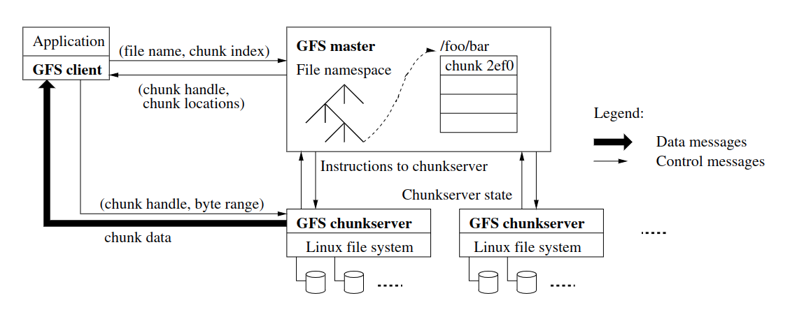
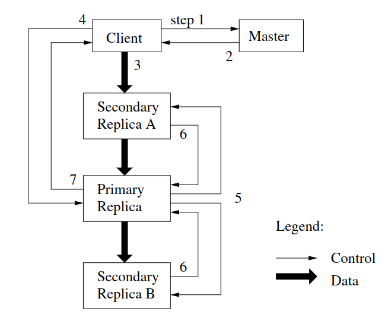

% gfs
% zdszero
% 2022-07-01

**Google File System**: a distributed file system that work on a large cluster

## intro

1. components failures are common
2. files are huge
3. most files are mutated by appending new data

**why hard?**

* performance --> sharding
* faults      --> tolerance
* tolerance   --> replication
* replication --> inconsistency
* consistency --> low performance

**tags**

big, fast, global, sharding, automatic recovery

## design

### assumption

read: large read most of the time, some times random small reads

### interface

not posix compliant, usual operations are supported: `create, delete, open, close, read, write`

additional operations: `snapshot, record append`

snapshot: create a copy at low cost

record append: concurrent append from multiple users with atomicity

### architecture

**defs** 

* master
* chunkserver
* client
* chunks

### metadata

**chunk locations**

poll chunkservers for that information at startup

**operation log**

critical, replicate it on multiple remote machines

## system interaction

### read & write

**READ**

1. name, offset → M
2. M sends H (chunk handler), list of S (cached)
3. C → CS, data is returned

**WRITE**

* no primary

1. master find up-to-date replicas
2. pick P, S
3. increment V#
4. tell P, S V# ---- LEASE
5. M writes V# to disk

* primary exist

P picks offset

all replicas told to write at offset

if all "yes", "success" → C

else "no" → C

## master operation

**master data**

filename ---> array of chunk handler (NV)

handle ---> list of chunkservers (V), version (NV), primary (V), lease expiration (V)

log, checkpoint ---- disk

**namespace management and locking**

**garbage collection**

## limitation

single master, load may to too big

master crash: no automatic recovery
