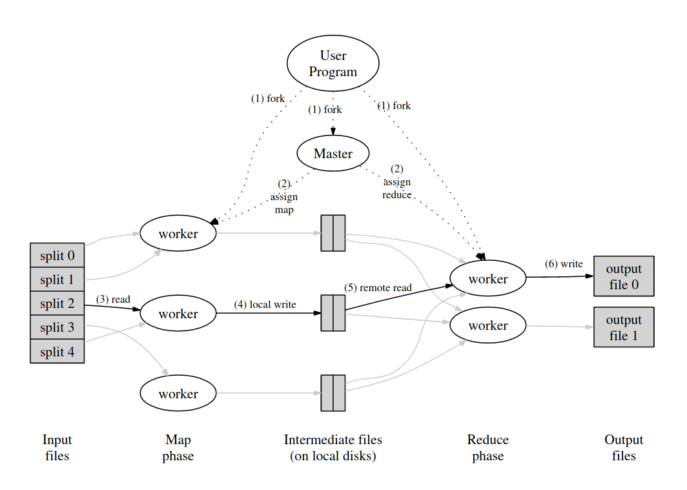

% mapreduce
% zdszero
% 2022-06-19

## def

map: takes an input pair and produces a set of intermidiate key/value pairs.

reduce: accepts an intermidiate key I and a set of values from that key. It merges together these values
to form a possibly smaller set of values.

## model

### master

the state of each map/reduce task: idle, in-progress, completed

identidy of each worker machine

### worker

## fault tolerance
