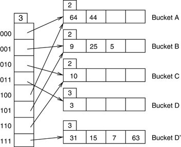

% extendible_hash



<Key, Value> is stored in bucket

Use Hash(Key) and global depth to get the index of the bucket which stores the <Key, Value>

## invariant

```
buckets_.size() = 2^(global_depth_)
bucket_num_ <= buckets_.size()

global_depth >= any(local_depth)
global_depth = max(local_depth)

bucket_reference_count = 2^(global_depth - local_depth)

for all the indexes that point to the same bucket with local_depth(ld):
	the ld LSB are the same
	index interval = (1 << ld)
```

## data

- hash table
- bucket

## methods

- `getIdx(key) → int`

```
return ((1 << global_depth) - 1) * Hash(key);
```

use lower bits is more convenient

- `insert(key, value) → void`

```
get key bucket
loop {
	if key in bucket or bucket is not full {
		update/insert key
		break
	}
	increase local depth
	if (local depth > global depth) {
		copy the buckets into itself
		increase global depth
	}
	create new bucket and redistribute key and values
	put new bueket into buckets
	get key bucket again
}
```

only when the bucket that is referenced only once overflows, the hash table doubles its size

May loop several times before break

- `redistribute()`

```
// before increasing local depth
high_bit = (1 << local_depth)
//  we used to get to the bucket by the local_depth LSB bits
//  so the pairs should be split into old/new page according to the high bitkk
```

- `find(key) → bool`
- `remove(key) → bool`
