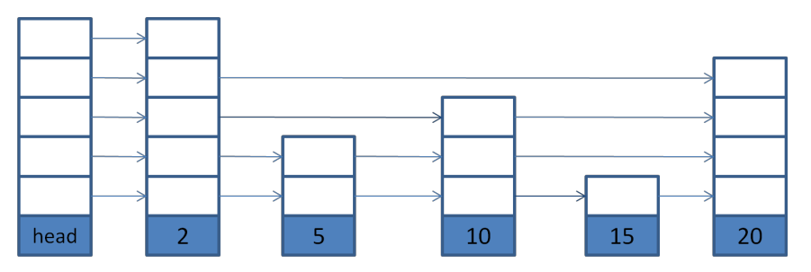

% skip list
% zdszero
% 2022-07-05



* __what is skip list__

skip list 所有的 node 就是一个排序的链表，考虑到操作效率，为这一个链表再添加若干不同跨度的辅助链表，查找时通过辅助链表可以跳跃比较来加大查找的步进。

每个链表上都是排序的 node，而每个 node 也可能同时处在多个链表上。将一个 node 所属链表的数量看作它的高度，那
么，不同高度的 node 在查找时会获得不同跳跃跨度的查找优化。

* __features__

假设当前结点的高度为height，那么Next(height-1)潜在地可以获得最大的步进，Next(0)的步进最小。

如果一个结点的Next(0)为nullptr的话，则说明该结点是skip list中最后一个结点。

* __algorithm__

寻找最后一个结点，如果不存在的话返回head

```cpp
Node *FindLast() {
    Node *x = head;
    int level = GetMaxHeight() - 1;
    while (true) {
        Node *next = x->Next(level);
        if (next == nullptr) {
            if (level == 0) {
                return x;
            } else {
                level--;
            }
        } else {
            x = next;
        }
    }
}
```

寻找lower_bound(key)的结点，不存在的话返回nullptr。思路：考虑实现`FindLessThan()`更加直观

```cpp
Node *FindLessThan(const Key &key) {
    Node *x = head;
    int level = GetMaxHeight() - 1;
    while (true) {
        Node *next = x->Next(level);
        if (next != nullptr && next->key < key) {
            x = next;
        } else {
            if (level == 0) {
                return x;
            } else {
                level--;
            }
        }
    }
}

Node *FindGreaterOrEqual(const Key &key) {
    Node *n = FindLessThan(key);
    if (n == head_) {
        return nullptr;
    }
    return n->Next(0);
}
```

插入

设置prev[kMaxSize]（其实只用到max_height）为指向新创建的结点的前一个位置的结点，在`FindGreaterOrEqual`函数中完成这一过程。

```cpp
Node *FindGreaterOrEqual(const Key &key, Node **prev) {
    Node *x = head;
    int level = GetMaxHeight() - 1;
    while (true) {
        Node *next = x->Next(level);
        // key is after the current node
        if (next != nullptr && next->key < key) {
            x = next;
        } else {
            // setting the previous of next
            if (prev != nullptr) prev[level] = x;
            if (level == 0) {
                return next;
            } else {
                level--;
            }
        }
    }
}

void Insert(const Key &key) {
    Node *prev[kMaxSize];
    Node *x = FindGreaterOrEqual(key, prev);
    int height = RandomHeight();
    if (height > GetMaxHeight()) {
        for (int i = GetMaxHeight(); i < height; i++) {
            prev[i] = head_;
        }
        SetMaxHeight(height);
    }
    for (int i = 0; i < height; i++) {
        x->SetNext(i, prev[i]->Next(i));
        prev[i]->SetNext(i, x);
    }
}
```
