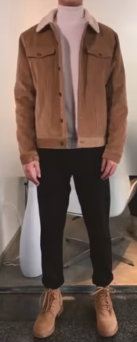
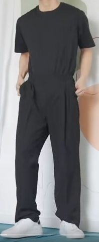

% wearing
% zdszero
% 2022-05-29

## figure（2022-05-29）

* 腰围：74cm
* 胸围：

## 想法

**原则**

* less is more，对于普通男生来说，穿搭干净、简约即可
* 重要性排名
    1. 衣服一定要fit（尺码、长度），修身、合身的衣服更加适合我
    2. 搭配

**小技巧**

* 内搭与裤子（裤子和鞋子）同色可以显得人更高
* 用饰品点缀你的穿搭

**雷区**

* 高腰裤、紧身裤、喇叭裤
* 卫衣加西裤、西服加牛仔裤
* polo杉领子立起来
* 深V衣服
* 不合身西服
* 超多logo
* 黑皮鞋和白袜子
* 限量版球鞋，花花绿绿的

## 穿搭

### 春秋

### 冬天

### 夏天

