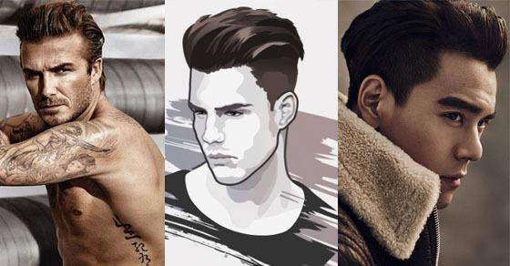
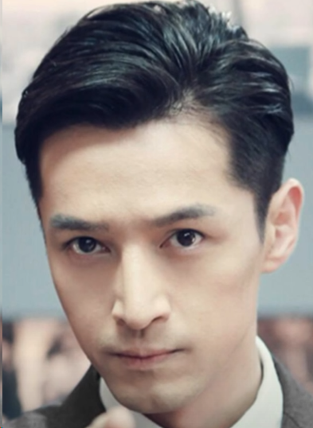
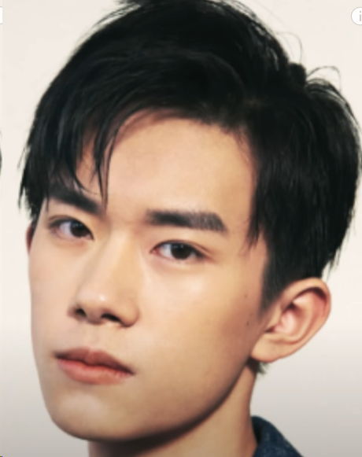
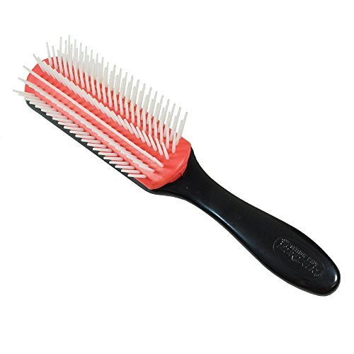
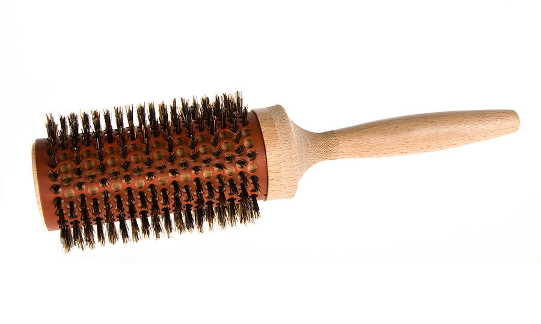
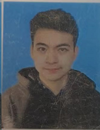
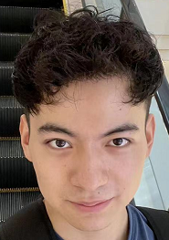
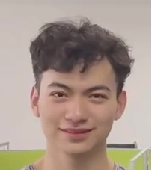
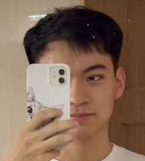

% haircut
% zdszero
% 2022-06-22

无论你拥有什么样的脸型，你都要找一个与之形成对比的发型，来得到一个平衡的脸型。使得好看的地方更突出，不好看的地方被遮掩。

## 发型

* **undercut**

两侧剪短，低渐变高渐变，上面可以尝试不同的风格

* **卷发，随性刘海**

* **中分，侧分**

## 工具

* 发泥、发蜡、发油

发泥：像黏土的感觉，做出来的发型呈哑色、没那么油腻，定型能力要比发蜡稍强

发蜡：膏状，更加清爽一点，容易均匀附着在发丝上

发油：油的感觉，光泽感更强

* 各种梳子

vented brush，7-row brush，排骨梳：适合中短发

round brush，圆梳：适合较长的长发，刘海长到鼻子或者更下面的位置

常见的为两种：

猪鬓毛梳：容易把头皮的油带到发尾，拉扯力较大，吹出来的头发会更顺滑和有光泽

尼龙圆梳：吹出来的头发会更加粗糙

comb，平梳

tail comb，尖尾梳

## 吹头发

**注意**

* 吹头前梳顺头发，头发湿的时候是最脆弱的时候

## 我的尝试

