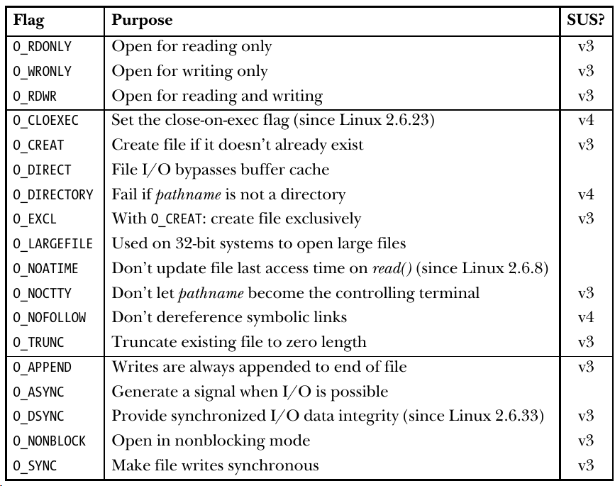
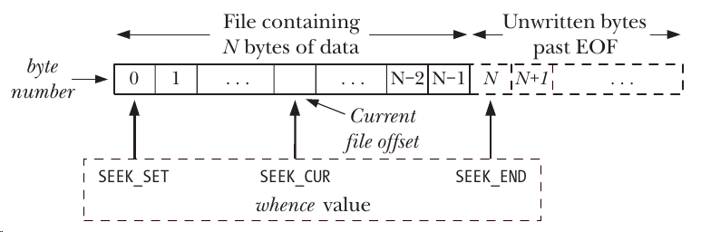
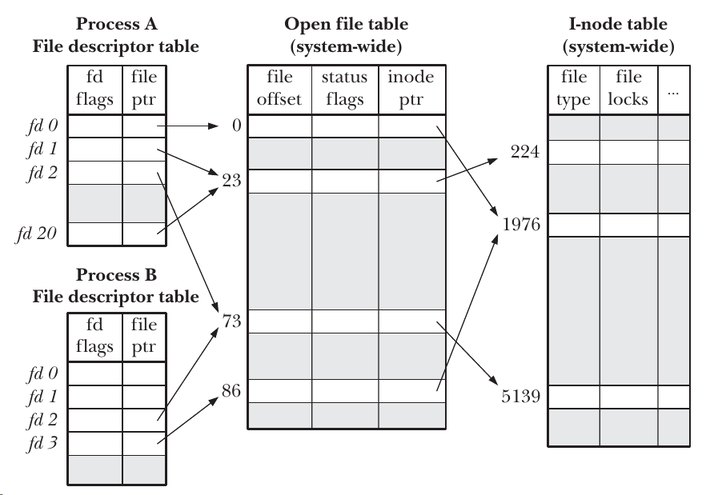
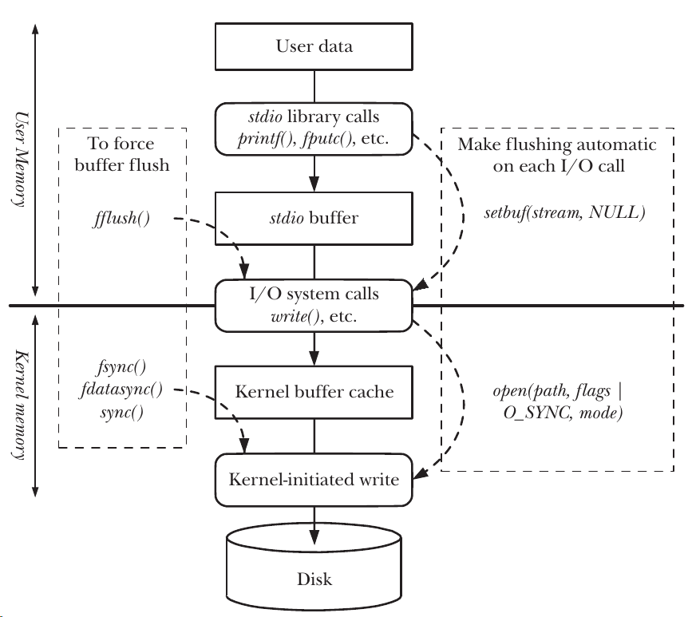

% File IO
% zdszero
% 2022-07-13

## universl medel

__everything is file__

In linux all system calls performing I/O refer to open files using a _file descriptor_.

* pipes
* FIFOs
* sockets
* terminals
* devices
* regular files

__open__



__create__ is like `open(pathname, O_WRONLY | O_CREAT | O_TRUNC, mode)`

__read, write__

__close__

__lseek__

__l__ means that the type of offset is __long__



file holes: the offset offset is allowed be after file size, in this case zeros are completed in this hole

__fcntl__

flie flags control

```c
// check file access mode
int flags;
flags = fcntl(fd, F_GETFL);
int accessMode = flags & O_ACCMODE;
if (accessMode == O_WRONLY || accessMode == O_RDWR)
    printf("file is writable\n");

// modify file status
flags = fcntl(fd, F_GETFL);
if (flags == -1)
    errExit("fcntl");
flags |= O_APPEND;
if (fcntl(fd, F_SETFL, flags) == -1)
    errExit("fcntl");
```

## more details

__relationship between fd and open files__



fd → open file description → I-node table entry

* Process A fd 1 and fd 20: using `dup(), dup2(), or fcntl()`
* Process A fd 2 and Process B fd 2: using `fork()`
* Process A fd 0 and Process B fd 3: calling `open()` twice

```c
#include <unistd.h>

// next usable fd
int dup(int oldfd);
// make oldfd refer to newfd
int dup2(int oldfd, int newfd);
// return value in [startfd, )
fcntl(fd, F_DUPFD, startfd);
```

__file I/O at a specifed offset__

```c
#include <unistd.h>

ssize_t pread(int fd, void *buf, size_t count, off_t offset);
ssize_t pwrite(int fd, const void *buf, size_t count, off_t offset);
```

__p__ means pthread, it is useful for multithreaded applications, avoid race conditions of file table offset.

__scatter-gather I/O__

```c
struct iovec {
    void *iov_start;
    size_t iov_len;
};

// scatter input
ssize_t readv(int fd, const struct iovec *iov, int iovcnt);
// gather output
ssize_t writev(int fd, const struct iovec *iov, int iovcnt);
```

atomicity, conveience, speed

__creating temporary files__

```c
#include <stdlib.h>
// template must include "XXXXXX"
int mkstemp(char *template);

#include <stdio.h>
FILE *tmpfile(void);
```

## buffering

__kernel buffering__

When calling system call `read(), write()`, the kernel doesn't write directly to the disk or read the exact content into memory.

Instead, they simple copy data between a user-space buffer and a buffer in the kernel space.

When reading or writing a file using system call, the number of system calls also decides the total executing time. The recommended size is 1024 or 4096

__stdio buffering__

Buffering of data into large blocks to reduce system calls

```c
#include <stdio.h>

int setvbuf(FILE *stream, char *buf, int mode, size_t size);
void setbuf(FILE *stream, char *buf);
void setbuffer(FILE *stream, char *buf, size_t size);
```

mode:

* `_IONBF`: no buffer, information appears in destination as soon as written.
* `_IOLBF`: line buffer. data is buffered until a newline character is met.
* `_IOFBF`: use block to buffer, many characters are saved up and written as a block.

the default behavior of `setbuf` is `setvbuf(stream, buf, buf == NULL ? _IOLBF : _IOFBF, BUFSIZ)`

use `int fflush(FILE *stream)` to flush the buffer

__controlling kernel buffering of file I/O__

_synchronized I/O data integrity completion_

* read: data has been transferred to process
* write: data has been transferred to disk and metadata has been written (The key point to note here is that not all modified file metadata attributes need to be transferred to allow the file data to be retrieved. )

_synchronized I/O file integrity completion_

superset of _data integrity_: all metadata is transferred to disk

```c
#include <unistd.h>

// file integrity
int fsync(int fd);
// data integrity
int fdatasync(int fd);
// sync system call
void sync(void);
```
open flags (all operations following a pattern):

* O_SYNC: file integrity
* O_DSYNC: data integrity
* O_RSYNC: all reads



__advising the kernel about I/O patterns__

```c
#include <fcntl.h>

int posix_fadvise(int fd, off_t offset, off_t len, int advice);
```

__bypass the buffering cache: direct I/O__

kernel caching is more efficent in most cases, it provides the following optimizations:

* buffer cache
* sequential read-ahead
* I/O in clusters of disk blocks
* allowing processes accessing the same file to share buffers in cache

__mixing library functions with system calls__


