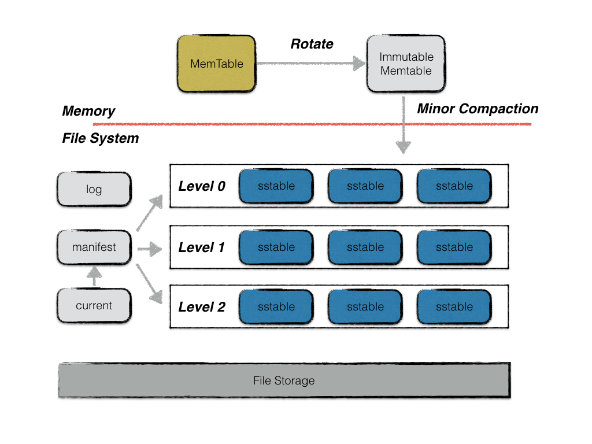

% arch
% zdszero
% 2022-07-09

leveldb是一个写性能十分优秀的存储引擎，是典型的LSM树(Log Structured-Merge Tree)实现。LSM树的核心思想就是放弃部分读的性能，换取最大的写入能力。

极高的性能来自于减少随机写的次数，对于每次写操作，不是直接将最新的数据驻留于磁盘中，而是将其拆分为

1. 一次日志文件的顺序秀
2. 一次内存中的数据插入

当内存中的数据达到一定的阈值，就将这部分数据真正刷新到磁盘中，因此获得了极高的写性能

* __memtable__: 内存中一个按照键值排序的map
* __immutable memtable__: 当memtable的容量达到阈值时，便会被转换为一个不可修改的memtable（只读）。当一个immutable memtable被创建时，leveldb的后台压缩进程便会将利用其中的内容，创建一个sstable，持久化到磁盘文件中。
* __log__: 保存写入memtable的内容，用于错误恢复 
* __sstable__: 持久化地存储memtable中的数据，sstable文件的内容是不可更改的。
* __manifest__: 记录version edit的信息
