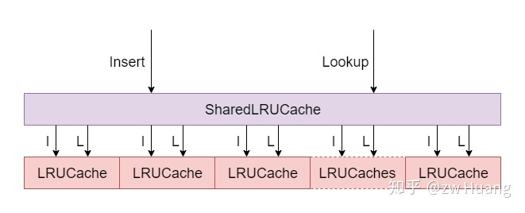
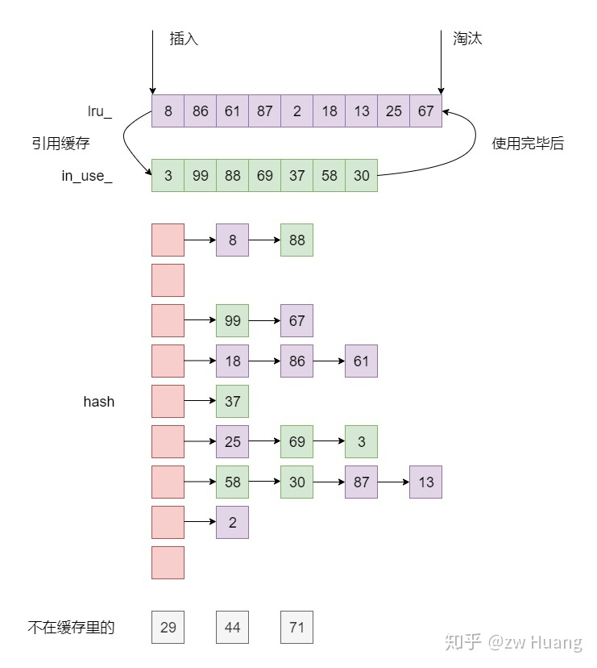

% cache
% zdszero
% 2022-07-10

## 分段锁缓存



在LRUCache内部加锁，在SharedLRUCache通过哈希函数将不同的访问分布到不同的LRUCache中，从而实现并发度。

## 缓存



__data member__

```
class LRUCache {
    mutable port::Mutex mutex_;
    size_t capacity_;
    size_t usage;

    LRUHandle in_use_;
    LRUHandle cache_;
    HandleTable table_;
};
```

## LRUHandle

作为entry存在，作为链表中的结点，存储缓存中的key和value

__data member__

```
struct LRUHandle {
    void *value;            // 值
    LRUHandle *next, *prev; // 双向链表中链接前后结点
    LRUHandle *next_hash;   // 哈希表中bucket的链表下一个结点
    size_t charge;          // 缓存项的大小
    size_t key_length;      // 键值长度
    bool in_cache;          // 是否在缓存中
    uint32_t refs;          // 计数次数
    uint32_t hash;          // 所在哈希表bucket链表中对应的哈希值
    char key_data[1];       // 键值
};
```

__ref count__

* 初始加入LRUCache，被放置在cache链表中，计数值为1
* 被访问后加入in_use链表（如果不在in_use链表中），计数值加一
* 访问结束后计数值减一，如果计数值为1，放回cache链表
* 当cache满了之后，如果有新的entry加入，选取cache链表中最后被访问的一个entry，计数值减一，调用删除函数将其删除

## 哈希表

__HandleTablea__ 是leveldb中哈希表的实现
