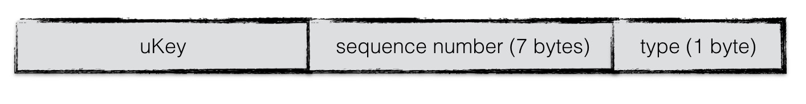
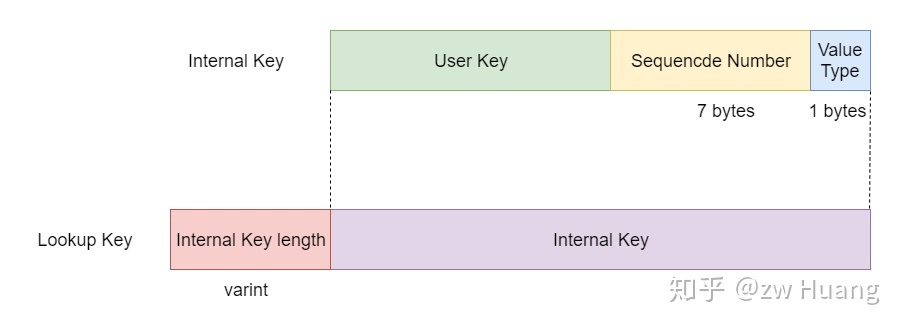

% keys
% zdszero
% 2022-07-11

leveldb中包含三种键：

* User Key是用户提供的键，是我们看到的键；
* Internal Key是实际存储的键，支持版本号和Tag的功能；
* Lookup Key则是为了查找MemTable而构造的键。

__internal key__

当数据项从batch中写入到内存数据库中时，需要将一个key值的转换，即在leveldb内部，所有数据项的key是经过特殊编码的，这种格式称为internalKey。



```
enum ValueType { kTypeDeletion = 0x0, kTypeValue = 0x1 };
typedef uint64_t SequenceNumber;

struct ParseInternalKey {
    Slice user_key;
    SequenceNumber sequence;
    ValueType type;
};
```

sequence number由leveldb内部维护，每进行一个操作就做一个累加，并且每一个操作都被赋予一个独特的sequence number。

一次更新或者一次删除，采用的是append的方式，并非直接更新原数据。因此对应同样一个key，会有多个版本的数据记录，而最大的sequence number对应的数据记录就是最新的。

当用户写入时，将User Key封装成Internal Key，保留版本信息，存储到SSTable里，当需要读取时，将User Key从Internal Key里提取出来，所有User Key相同的Internal Key里面SequenceNumber最大的Internal Key就是当前的键，它对应的值就是当前值。

__lookup key__

LookupKey is used in memtable



```
class LookupKey {
private:
    // klength varint32                    <-- start_
    // userkey                             <-- kstart_
    // tag (sequence number, value type)   
                                           <-- end_
    const char* start_;
    const char *kstart_;
    const char *end_;
};

| klength |        Internal Key        |
| klength | user key | sequence + type |
   varint     slice      7B        1B
```

klength is the size of internal key stored in varint format

__memtable entry__

LookupKey + Value

```
| klength |        Internal Key        |  vlength  |  value  |
| klength | user key | sequence + type |  vlength  |  value  |
   varint     slice      7B        1B     varint      slice
```
