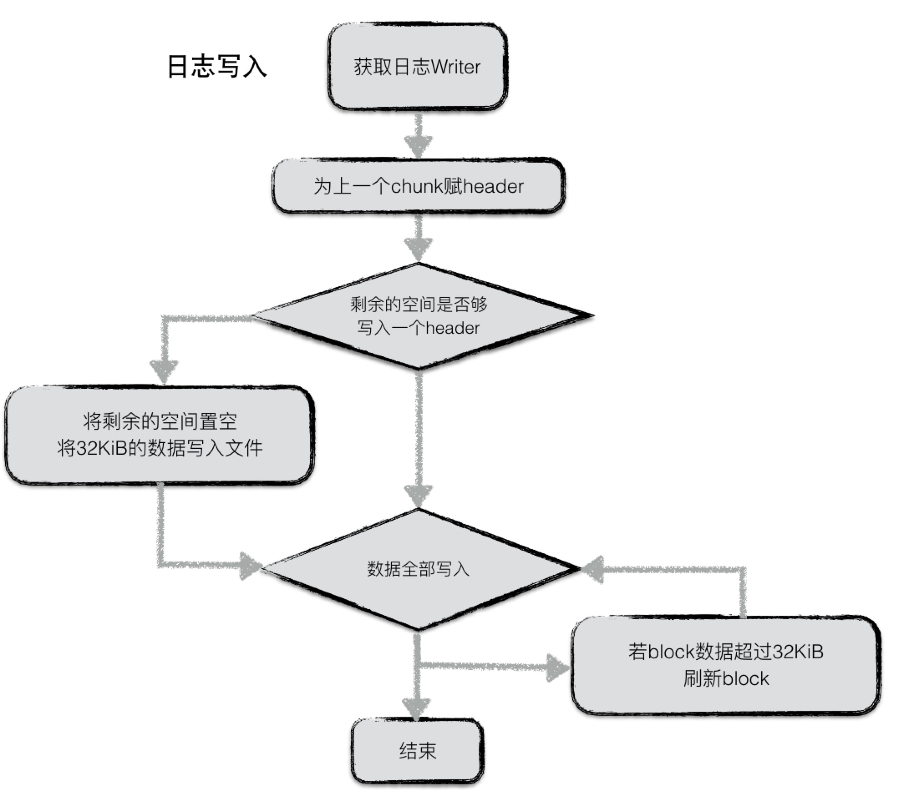
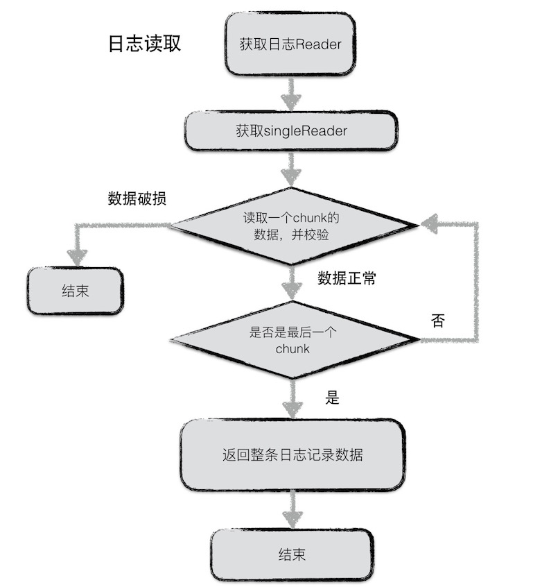

% log
% zdszero
% 2022-07-09

leveldb的写操作并不是直接写入磁盘的，而是首先写入到内存。假设写入到内存的数据还未来得及持久化，leveldb进程发生了异常，抑或是宿主机器发生了宕机，会造成用户的写入发生丢失。因此leveldb在写内存之前会首先将所有的写操作写到日志文件中，也就是log文件。当以下异常情况发生时，均可以通过日志文件进行恢复：

1. 写log期间进程异常；
2. 写log完成，写内存未完成；
3. write动作完成（即log、内存写入都完成）后，进程异常；
4. Immutable memtable持久化过程中进程异常；
5. 其他压缩异常（较为复杂，首先不在这里介绍）；

当第一类情况发生时，数据库重启读取log时，发现异常日志数据，抛弃该条日志数据，即视作这次用户写入失败，保障了数据库的一致性；

当第二类，第三类，第四类情况发生了，均可以通过redo日志文件中记录的写入操作完成数据库的恢复。

每次日志的写操作都是一次顺序写，因此写效率高，整体写入性能较好。

此外，leveldb的用户写操作的原子性同样通过日志来实现。

## 结构

log → block → chunk → entries

__chunk__

| checksum (4B) | length (2B) | type (1B) | data |
|:-:|:-:|:-:|:-:|

type: full, first, middle, last

__data__

| sequence number | entry number | batch data | ... | batch data |
| :-: | :-: | :-: | :-: | :-: |

## 写

日志写入流程较为简单，在leveldb内部，实现了一个journal的writer。首先调用Next函数获取一个singleWriter，这个singleWriter的作用就是写入一条journal记录。

singleWriter开始写入时，标志着第一个chunk开始写入。在写入的过程中，不断判断writer中buffer的大小，若超过32KiB，将chunk开始到现在做为一个完整的chunk，为其计算header之后将整个chunk写入文件。与此同时reset buffer，开始新的chunk的写入。

若一条journal记录较大，则可能会分成几个chunk存储在若干个block中。

## 读

同样，日志读取也较为简单。为了避免频繁的IO读取，每次从文件中读取数据时，按block（32KiB）进行块读取。

每次读取一条日志记录，reader调用Next函数返回一个singleReader。singleReader每次调用Read函数就返回一个chunk的数据。每次读取一个chunk，都会检查这批数据的校验码、数据类型、数据长度等信息是否正确，若不正确，且用户要求严格的正确性，则返回错误，否则丢弃整个chunk的数据。

循环调用singleReader的read函数，直至读取到一个类型为Last的chunk，表示整条日志记录都读取完毕，返回。
