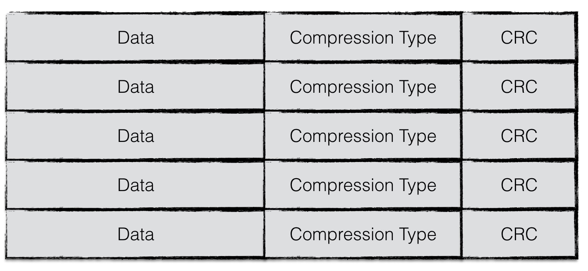
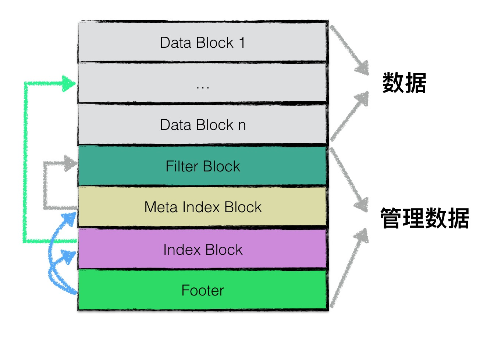
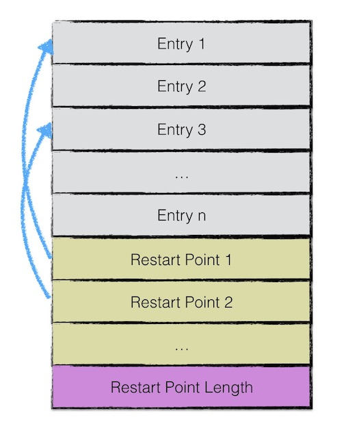
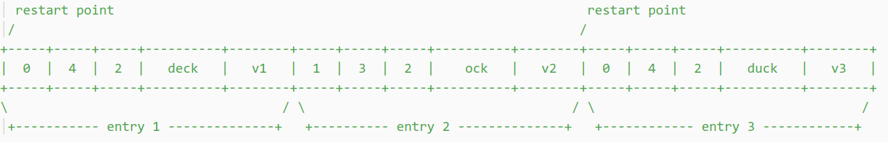
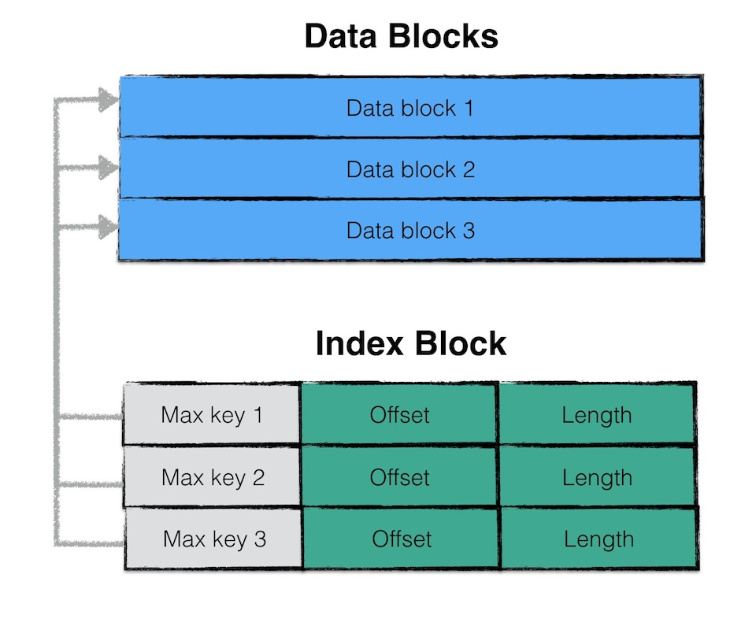

% sstable
% zdszero
% 2022-07-09

## 概述

虽然在内存中，所有的数据都是按序排列的，但是当多个memetable数据持久化到磁盘后，对应的不同的sstable之间是存在交集的，在读操作时，需要对所有的sstable文件进行遍历，严重影响了读取效率。因此leveldb后台会“定期“整合这些sstable文件，该过程也称为compaction。随着compaction的进行，sstable文件在逻辑上被分成若干层，由内存数据直接dump出来的文件称为level 0层文件，后期整合而成的文件为level i 层文件，这也是leveldb这个名字的由来。

## 文件格式

### 物理结构



### 逻辑结构

在逻辑上，根据功能不同，leveldb在逻辑上又将sstable分为：

1. data block: 用来存储key value数据对；
2. filter block: 用来存储一些过滤器相关的数据（布隆过滤器），但是若用户不指定leveldb使用过滤器，leveldb在该block中不会存储任何内容；
3. meta Index block: 用来存储filter block的索引信息（索引信息指在该sstable文件中的偏移量以及数据长度）；
4. index block：index block中用来存储每个data block的索引信息；
5. footer: 用来存储meta index block及index block的索引信息；



## data block

__sstable__



| entry0 | entry1 | ...... | restarts | num_of_restarts |
|:-:|:-:|:-:|:-:|:-:|:-:|
| 第一个K-V entry | 第二个 | ...... | 分区前缀的offset | 总共压缩的轮数 |

如果不分区，对每个key的查找，都要从block的头开始，所以进一步细化粒度，对前缀进行分段处理。若干个（Option::block_restart_interval）key做前缀压缩之后，就重新开始下一轮。每一轮前缀压缩的 block offset 保存在 restarts 中，num_of_restarts 记录着总共压缩的轮数（有多少个前缀分区）。


__entry__

一份key-value数据作为block中的一个entry。虑节约空间，leveldb 对 key 的存储进行前缀压缩，每个 entry 中会记录 key 与前一个 key 前缀相同的字节（shared_bytes）以及自己独有的字节（unshared_bytes）。读取时，对 block 进行遍历，每个 key 根据前一个 key 以及 shared_bytes/unshared_bytes 可以构造出来。


| shared_bytes | unshared_bytes | value_bytes | unshared_key_data | value_data |
|:-:|:-:|:-:|:-:|:-:|
| 当前key与前一个key相同的字节前缀数量 | 不同的字节数量 | 值的字节数量 | unshared data存储位置 | value存储位置 |

比如对于

```
restart_interval = 2
entry one    : key=deck, value=v1
entry two    : key=dock, value=v2
entry two    : key=duck, value=v2
```



```
 restart points   num of restarts
/                 \ /      \
+---------+--------+--------+
|    0    |   16   |    2   |
+---------+--------+--------+
```

## filter block


## meta index block

只包含一条记录：

* key: 与过滤器名字组成的常量字符串
* value: filter block在sstable中的索引信息序列化后的内容，索引信息包括
    * 在sstable中的偏移量
    * 数据长度

## index block

与meta index block类似，index block用来存储所有data block的相关索引信息。

indexblock包含若干条记录，每一条记录代表一个data block的索引信息。



## meta block

footer大小固定，为48字节，用来存储meta index block与index block在sstable中的索引信息


